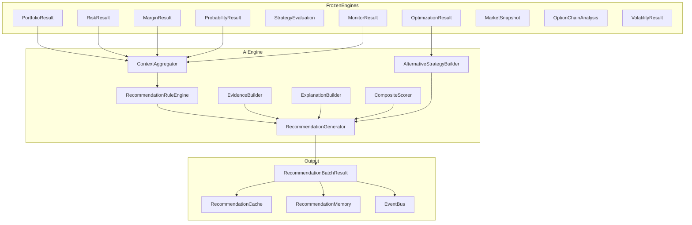

# AI Architecture

## Overview

The AI Recommendation Engine is a decision-support layer that consumes outputs from frozen quantitative engines. It never calculates pricing, Greeks, probability, payoff, risk, margin, or strategy mathematics.

## Principles

1. **No invented data** — Every metric traces to an engine output
2. **Mandatory explainability** — No recommendation without evidence and explanation
3. **Rule-first** — Default path uses configurable rules (no LLM required)
4. **LLM-ready** — Provider abstraction for future OpenAI, Anthropic, Bedrock, Gemini, local models

## Architecture Diagram

## Layers

| Layer | Responsibility |
|-------|----------------|
| Analytics | Aggregate engine metrics into context snapshot |
| Rules | Configurable threshold rules |
| Recommendations | Generate `RecommendationResult` with evidence |
| Explainability | Why, trade-offs, risks, rewards |
| Scoring | Confidence, impact, risk, capital, liquidity, priority |
| Prompts | Template framework for future LLM enrichment |
| Providers | `LLMProvider` abstraction (`NullLLMProvider` default) |
| Advisors | Supplementary advisory notes per domain |
| Memory | Recent, history, dismissed, accepted, pinned |
| Cache | Latest, history, dismissed, accepted |

## Recommendation Categories

- New Strategy
- Position Adjustment
- Take Profit
- Reduce Loss
- Roll Position
- Increase Hedge
- Reduce Margin
- Capital Optimization
- Risk Reduction
- Portfolio Diversification

## Extensibility

Future support for fine-tuned models, RAG, multi-agent AI, voice assistant, and auto strategy builder.
