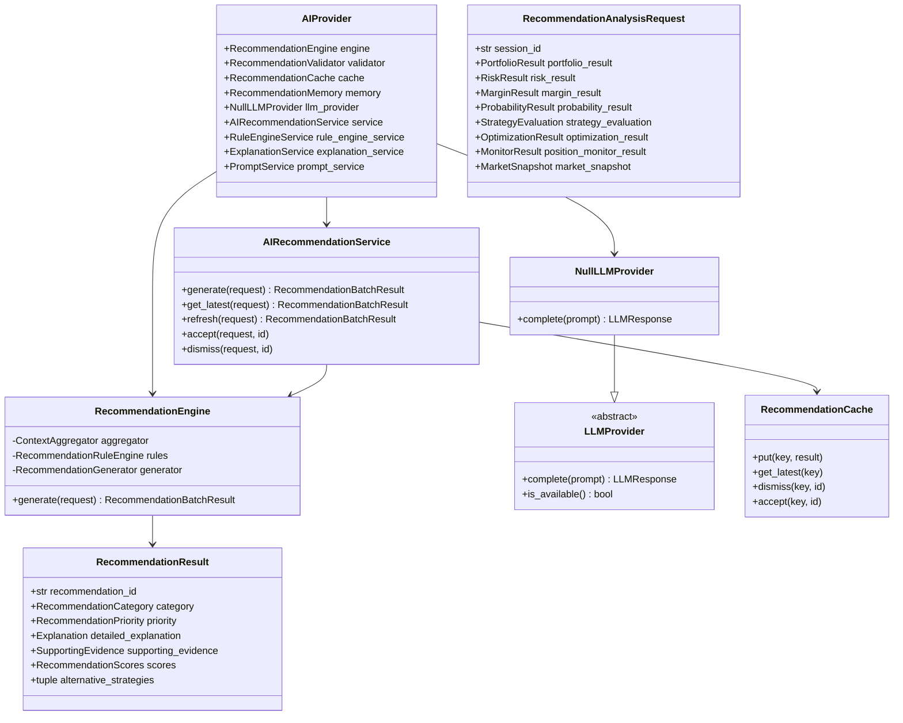

# AI Class Diagram

```mermaid
classDiagram
    class AIProvider {
        +RecommendationEngine engine
        +RecommendationValidator validator
        +RecommendationCache cache
        +RecommendationMemory memory
        +NullLLMProvider llm_provider
        +AIRecommendationService service
        +RuleEngineService rule_engine_service
        +ExplanationService explanation_service
        +PromptService prompt_service
    }

    class AIRecommendationService {
        +generate(request) RecommendationBatchResult
        +get_latest(request) RecommendationBatchResult
        +refresh(request) RecommendationBatchResult
        +accept(request, id)
        +dismiss(request, id)
    }

    class RecommendationEngine {
        +generate(request) RecommendationBatchResult
        -ContextAggregator aggregator
        -RecommendationRuleEngine rules
        -RecommendationGenerator generator
    }

    class RecommendationAnalysisRequest {
        +str session_id
        +PortfolioResult portfolio_result
        +RiskResult risk_result
        +MarginResult margin_result
        +ProbabilityResult probability_result
        +StrategyEvaluation strategy_evaluation
        +OptimizationResult optimization_result
        +MonitorResult position_monitor_result
        +MarketSnapshot market_snapshot
    }

    class RecommendationResult {
        +str recommendation_id
        +RecommendationCategory category
        +RecommendationPriority priority
        +Explanation detailed_explanation
        +SupportingEvidence supporting_evidence
        +RecommendationScores scores
        +tuple alternative_strategies
    }

    class LLMProvider {
        <<abstract>>
        +complete(prompt) LLMResponse
        +is_available() bool
    }

    class NullLLMProvider {
        +complete(prompt) LLMResponse
    }

    class RecommendationCache {
        +put(key, result)
        +get_latest(key)
        +dismiss(key, id)
        +accept(key, id)
    }

    AIProvider --> AIRecommendationService
    AIProvider --> RecommendationEngine
    AIProvider --> NullLLMProvider
    NullLLMProvider --|> LLMProvider
    AIRecommendationService --> RecommendationEngine
    AIRecommendationService --> RecommendationCache
    RecommendationEngine --> RecommendationResult
```
