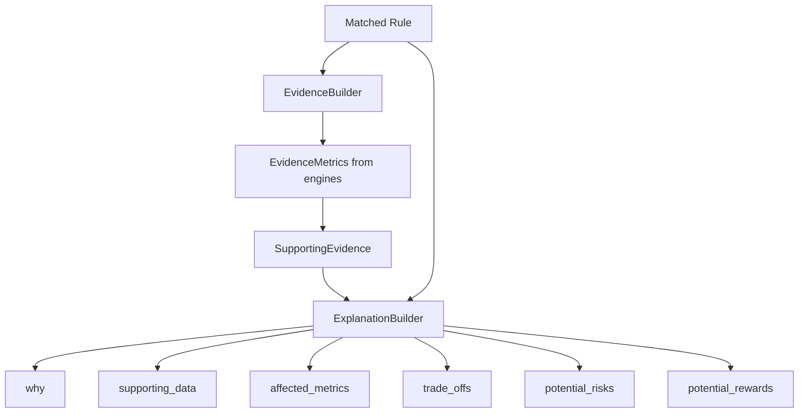

# Explainability Flow

## Mandatory Explainability

Every `RecommendationResult` must include:

1. `detailed_explanation` — full `Explanation` object
2. `supporting_evidence` — traceable `SupportingEvidence` with engine metrics

Recommendations failing validation raise `MissingEvidenceError`.

## Explanation Structure

## Evidence Traceability

Each `EvidenceMetric` includes:

| Field | Purpose |
|-------|---------|
| `source` | Engine enum (PORTFOLIO, RISK, MARGIN, etc.) |
| `metric_name` | Metric identifier |
| `metric_value` | String value from engine |
| `engine_reference` | Dotted reference e.g. `RISK.net_delta` |

## Explanation Fields

| Field | Content |
|-------|---------|
| Why | Rule condition and breached threshold |
| Supporting data | Evidence summary |
| Affected metrics | Metrics impacted by suggested action |
| Trade-offs | Benefit vs risk pairs |
| Potential risks | Current risk state from engines |
| Potential rewards | Expected improvement from action |

## Validation Gates

`RecommendationValidator` enforces:

- Evidence must contain at least one metric
- Each metric must have `engine_reference`
- Explanation must have non-empty `why`
- `confidence_score` between 0 and 1

## LLM Enrichment (Future)

`PromptService` can render templates and pass to `LLMProvider` for narrative enrichment. Default `NullLLMProvider` returns empty — rules drive all output today.

No LLM output is used without passing evidence validation.
