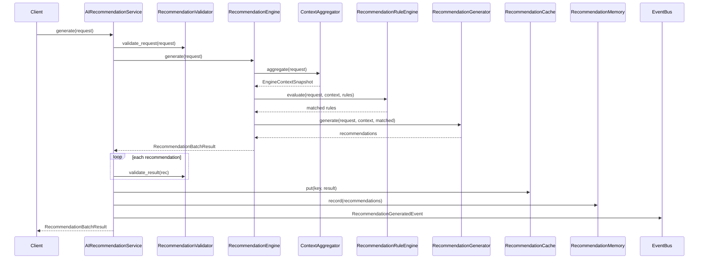
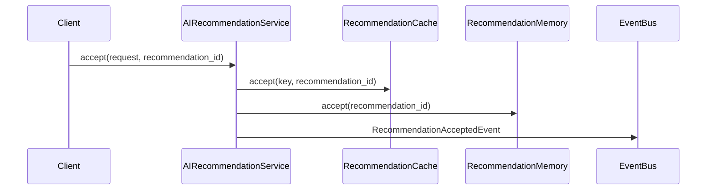
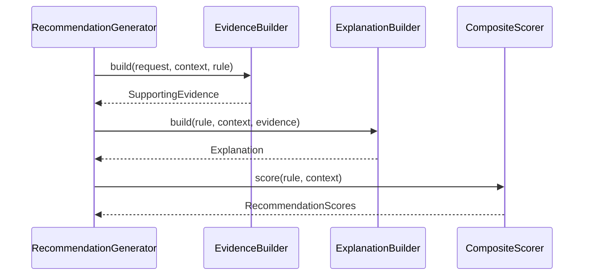

# AI Sequence Diagram

## Generate Recommendations

```mermaid
sequenceDiagram
    participant Client
    participant Service as AIRecommendationService
    participant Validator as RecommendationValidator
    participant Engine as RecommendationEngine
    participant Aggregator as ContextAggregator
    participant Rules as RecommendationRuleEngine
    participant Generator as RecommendationGenerator
    participant Cache as RecommendationCache
    participant Memory as RecommendationMemory
    participant Bus as EventBus

    Client->>Service: generate(request)
    Service->>Validator: validate_request(request)
    Service->>Engine: generate(request)
    Engine->>Aggregator: aggregate(request)
    Aggregator-->>Engine: EngineContextSnapshot
    Engine->>Rules: evaluate(request, context, rules)
    Rules-->>Engine: matched rules
    Engine->>Generator: generate(request, context, matched)
    Generator-->>Engine: recommendations
    Engine-->>Service: RecommendationBatchResult
    loop each recommendation
        Service->>Validator: validate_result(rec)
    end
    Service->>Cache: put(key, result)
    Service->>Memory: record(recommendations)
    Service->>Bus: RecommendationGeneratedEvent
    Service-->>Client: RecommendationBatchResult
```

## Accept Recommendation

```mermaid
sequenceDiagram
    participant Client
    participant Service as AIRecommendationService
    participant Cache as RecommendationCache
    participant Memory as RecommendationMemory
    participant Bus as EventBus

    Client->>Service: accept(request, recommendation_id)
    Service->>Cache: accept(key, recommendation_id)
    Service->>Memory: accept(recommendation_id)
    Service->>Bus: RecommendationAcceptedEvent
```

## Explainability Build

```mermaid
sequenceDiagram
    participant Generator as RecommendationGenerator
    participant Evidence as EvidenceBuilder
    participant Explainer as ExplanationBuilder
    participant Scorer as CompositeScorer

    Generator->>Evidence: build(request, context, rule)
    Evidence-->>Generator: SupportingEvidence
    Generator->>Explainer: build(rule, context, evidence)
    Explainer-->>Generator: Explanation
    Generator->>Scorer: score(rule, context)
    Scorer-->>Generator: RecommendationScores
```
