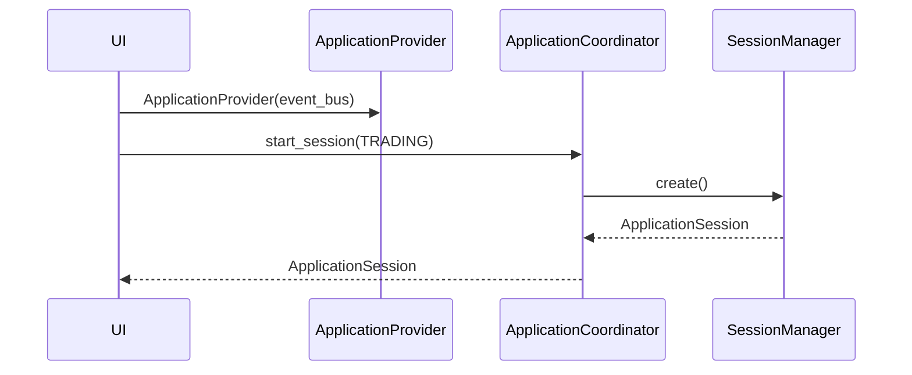
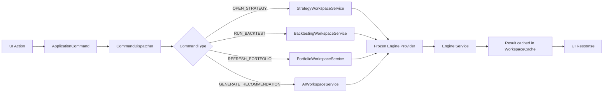
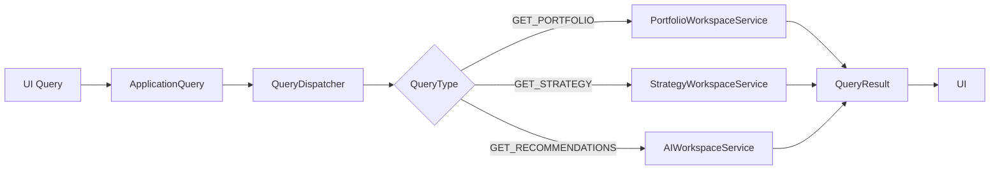

# Application Flow

## Startup Flow

## Command Flow

## Query Flow

## Event Flow

| Event | Trigger |
|-------|---------|
| `WorkspaceOpenedEvent` | `WorkspaceCoordinator.open_workspace()` |
| `WorkspaceClosedEvent` | `WorkspaceCoordinator.close_workspace()` |
| `StrategyLoadedEvent` | `ApplicationCoordinator.notify_strategy_loaded()` |
| `PortfolioLoadedEvent` | `ApplicationCoordinator.notify_portfolio_loaded()` |
| `BacktestStartedEvent` | `ApplicationCoordinator.notify_backtest_started()` |
| `RecommendationReadyEvent` | `ApplicationCoordinator.notify_recommendation_ready()` |

## Session State

`ApplicationSession` tracks:

- Active workspace
- Per-workspace state (`WorkspaceState`)
- Recent files and strategies
- User preferences
