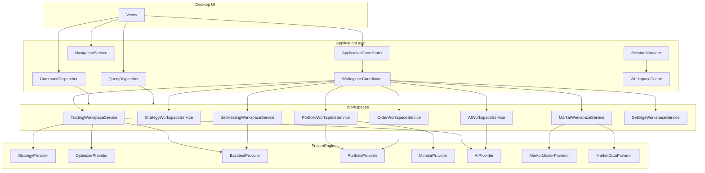

# Application Architecture

## Overview

The Application Services Layer sits between the Desktop UI and all frozen business engines. It orchestrates engine providers, manages sessions, and exposes workspace-specific APIs.

## Architecture Diagram

## Layers

| Layer | Responsibility |
|-------|----------------|
| Coordinator | Application lifecycle, session start, event notification |
| Workspace Coordinator | Open/close workspaces, route views |
| Workspace Services | Simplified APIs delegating to engine providers |
| Command/Query Dispatch | CQRS routing from UI actions |
| Session | ApplicationSession, preferences, recents |
| Cache | Recent data, reports, strategies |
| Engine Registry | DI container for frozen providers |

## Design Rules

1. **No calculations** — orchestration only
2. **No broker logic** — order intents are framework placeholders
3. **No UI code** — DTOs and services only
4. **Single gateway** — UI never imports engine modules directly

## Extensibility

The same `ApplicationProvider` can back:

- Desktop UI (current)
- REST API gateway (future)
- gRPC services (future)
- Web and mobile clients (future)

Business engines remain unchanged.
