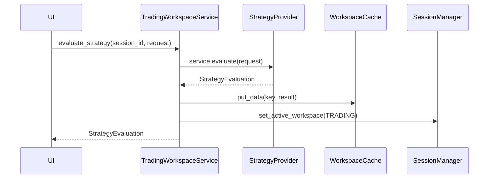
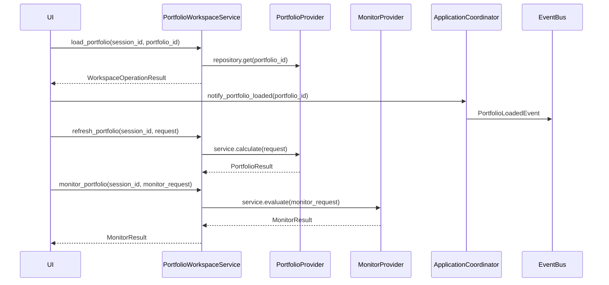
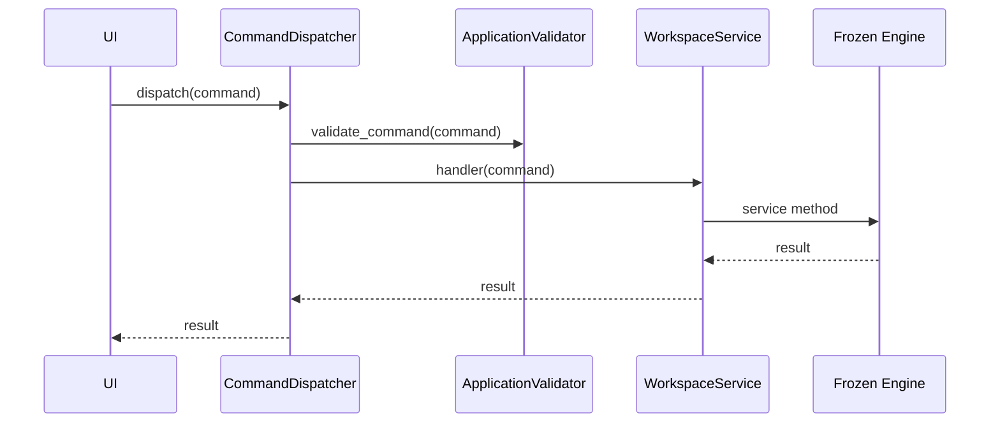
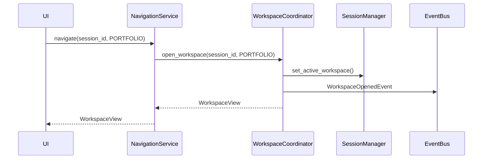

# Application Sequence Diagram

## Evaluate Strategy (Trading Workspace)

```mermaid
sequenceDiagram
    participant UI
    participant Trading as TradingWorkspaceService
    participant Strategy as StrategyProvider
    participant Cache as WorkspaceCache
    participant Sessions as SessionManager

    UI->>Trading: evaluate_strategy(session_id, request)
    Trading->>Strategy: service.evaluate(request)
    Strategy-->>Trading: StrategyEvaluation
    Trading->>Cache: put_data(key, result)
    Trading->>Sessions: set_active_workspace(TRADING)
    Trading-->>UI: StrategyEvaluation
```

## Load and Monitor Portfolio

```mermaid
sequenceDiagram
    participant UI
    participant Portfolio as PortfolioWorkspaceService
    participant PP as PortfolioProvider
    participant MP as MonitorProvider
    participant Coordinator as ApplicationCoordinator
    participant Bus as EventBus

    UI->>Portfolio: load_portfolio(session_id, portfolio_id)
    Portfolio->>PP: repository.get(portfolio_id)
    Portfolio-->>UI: WorkspaceOperationResult
    UI->>Coordinator: notify_portfolio_loaded(portfolio_id)
    Coordinator->>Bus: PortfolioLoadedEvent

    UI->>Portfolio: refresh_portfolio(session_id, request)
    Portfolio->>PP: service.calculate(request)
    PP-->>Portfolio: PortfolioResult

    UI->>Portfolio: monitor_portfolio(session_id, monitor_request)
    Portfolio->>MP: service.evaluate(monitor_request)
    MP-->>Portfolio: MonitorResult
    Portfolio-->>UI: MonitorResult
```

## Command Dispatch

```mermaid
sequenceDiagram
    participant UI
    participant CD as CommandDispatcher
    participant Validator as ApplicationValidator
    participant WS as WorkspaceService
    participant Engine as Frozen Engine

    UI->>CD: dispatch(command)
    CD->>Validator: validate_command(command)
    CD->>WS: handler(command)
    WS->>Engine: service method
    Engine-->>WS: result
    WS-->>CD: result
    CD-->>UI: result
```

## Navigation

```mermaid
sequenceDiagram
    participant UI
    participant Nav as NavigationService
    participant WC as WorkspaceCoordinator
    participant Sessions as SessionManager
    participant Bus as EventBus

    UI->>Nav: navigate(session_id, PORTFOLIO)
    Nav->>WC: open_workspace(session_id, PORTFOLIO)
    WC->>Sessions: set_active_workspace()
    WC->>Bus: WorkspaceOpenedEvent
    WC-->>Nav: WorkspaceView
    Nav-->>UI: WorkspaceView
```
