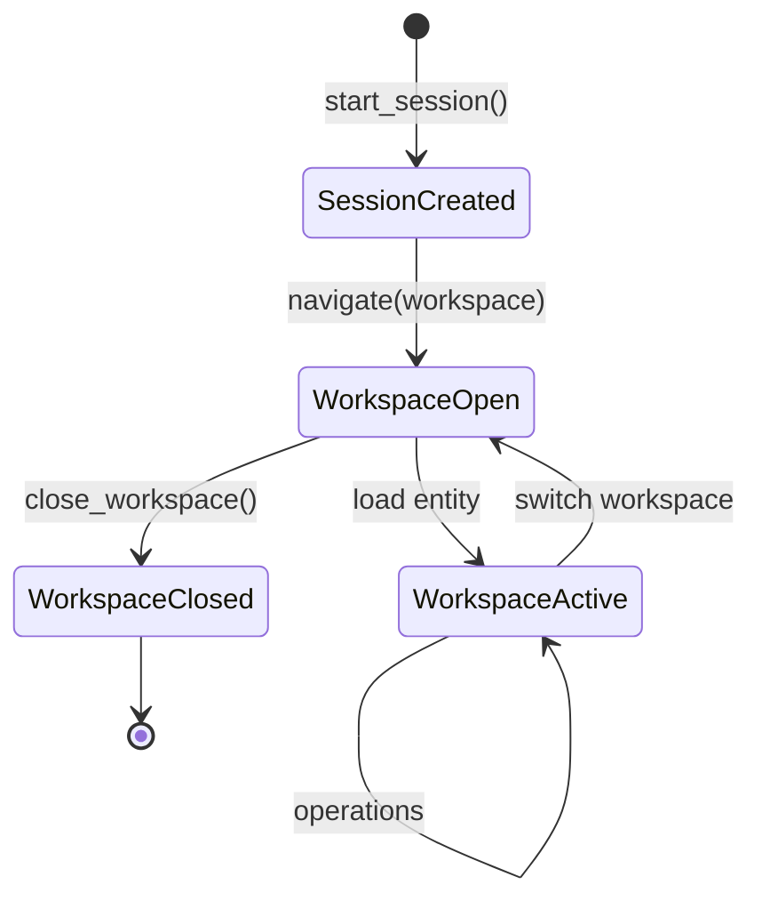
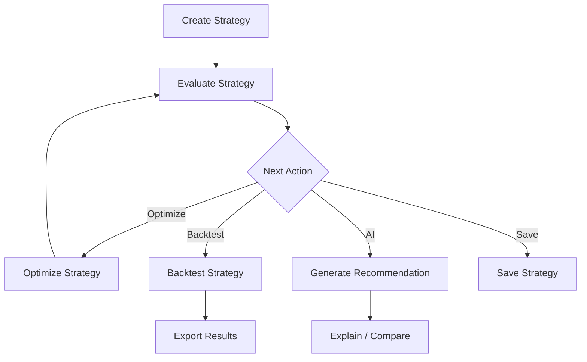

# Workspace Flow

## Workspace Lifecycle

## Trading Workspace

## Portfolio Workspace

| Operation | Delegates To |
|-----------|--------------|
| Load Portfolio | `PortfolioProvider.repository` |
| Refresh Portfolio | `PortfolioProvider.service.calculate()` |
| Monitor Portfolio | `MonitorProvider.service.evaluate()` |
| Generate Report | `PortfolioProvider.service.build_report()` |
| Export Report | `WorkspaceCache` |

## Backtesting Workspace

| State | Actions Available |
|-------|-------------------|
| IDLE | Run, Replay |
| RUNNING | Pause, Stop |
| PAUSED | Resume, Stop |
| STOPPED | Run |
| COMPLETED | Export Results |

## Market Workspace

- **Watchlist** — symbol list per session
- **Market Overview** — cached market data
- **Option Chain** — chain data from cache/engine
- **Market Scanner** — framework placeholder
- **Volatility Dashboard** — framework placeholder

## AI Workspace

- **Generate** — `AIProvider.service.generate()`
- **Explain** — returns `Explanation` from result
- **Compare** — rank by priority score
- **History** — `AIProvider.memory.state()`

## Order Workspace

Order intents are queued locally. No broker execution. Open positions read from portfolio engine.

## Settings Workspace

User preferences stored in `ApplicationSession` via `SessionManager`.
