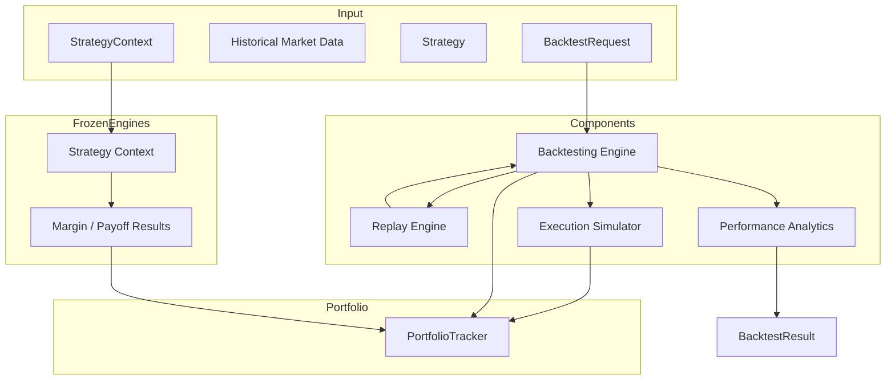

# Backtesting Architecture

## Component Independence

Each component is independently testable and replaceable:

- **Replay** — no knowledge of execution or analytics
- **Execution** — configurable slippage/fees, no pricing formulas
- **Backtest Engine** — pure orchestration
- **Analytics** — trade log and equity curve only
