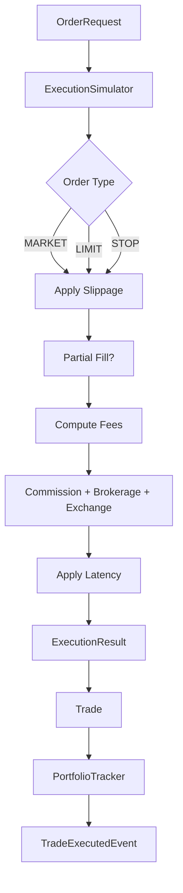

# Execution Flow

## Execution Model

| Parameter | Default |
|-----------|---------|
| Slippage | 0.05% |
| Commission | ₹20 per trade |
| Brokerage | 0.03% |
| Exchange charges | 0.01% |
| Latency | 50ms |
| Partial fill | Enabled |

## Order Types

- Market — immediate fill with slippage
- Limit — framework ready
- Stop — framework ready

No broker-specific logic; fully configurable via `ExecutionConfig`.
