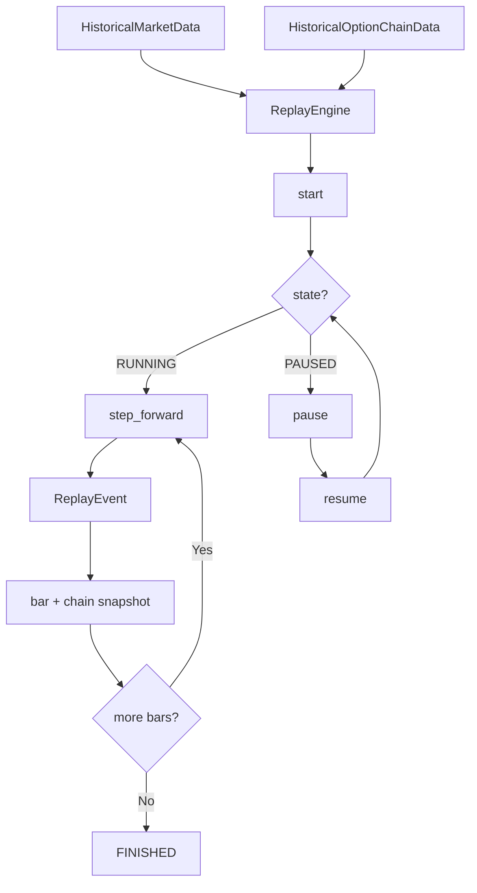

# Replay Flow

## Controls

| Control | Description |
|---------|-------------|
| `start` | Begin replay from index |
| `pause` / `resume` | Pause and resume session |
| `step_forward` | Advance by step_size × speed |
| `fast_forward` | Jump to bar index |
| `set_speed` | 1x, 2x, 5x, 10x, MAX |

## Events

- `ReplayStartedEvent` — session begins
- `ReplayPausedEvent` — session paused
- `ReplayFinishedEvent` — all bars consumed
