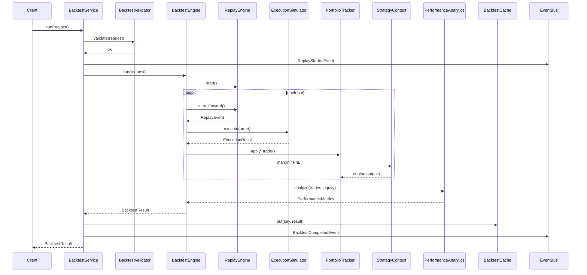

# Backtesting Sequence Diagram

## Data Flow

1. Replay provides historical prices (no pricing engine)
2. Execution simulates fills with slippage and fees
3. Portfolio tracks positions and cash
4. Margin and unrealized PnL from `StrategyContext` (frozen engines)
5. Analytics computes performance metrics from trade log and equity curve
