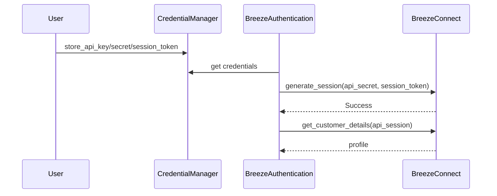

# Authentication Flow

Official login URL: `https://api.icicidirect.com/apiuser/login?api_key={encoded_key}`

Session tokens expire daily. Use `refresh_session()` before timeout configured in `broker.yaml`.
