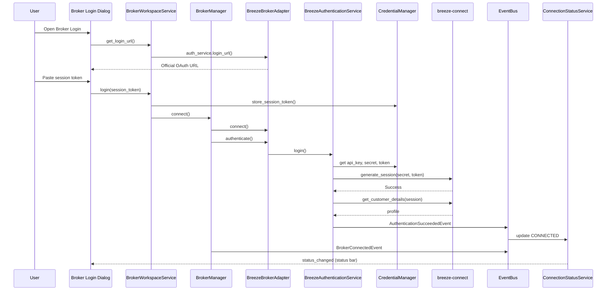
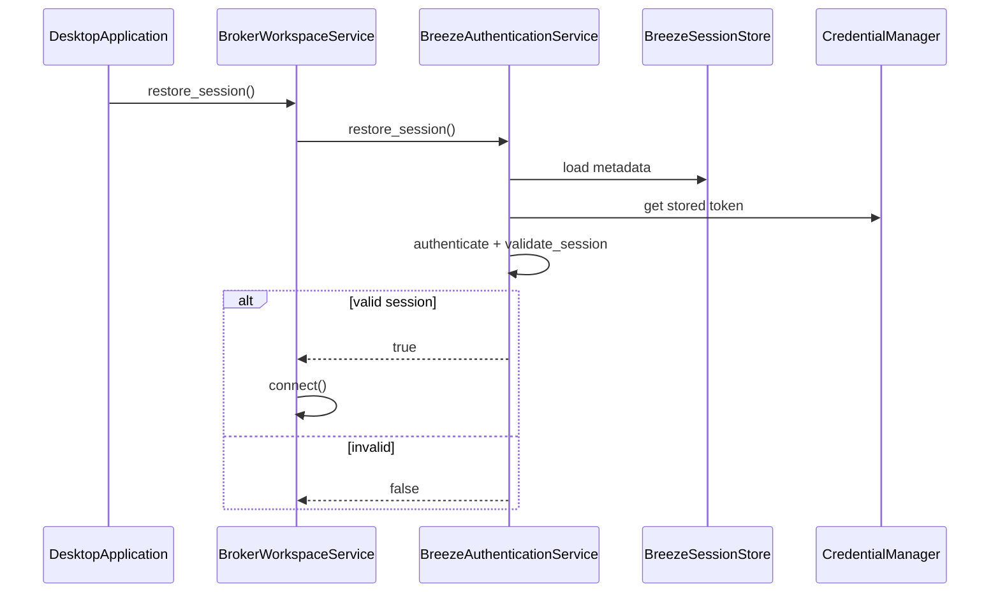
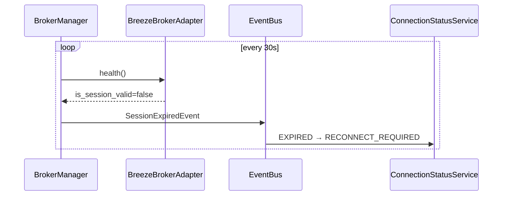

# Breeze Authentication Sequence Diagram

## Login Flow

```mermaid
sequenceDiagram
    participant User
    participant UI as Broker Login Dialog
    participant BWS as BrokerWorkspaceService
    participant BM as BrokerManager
    participant Adapter as BreezeBrokerAdapter
    participant Auth as BreezeAuthenticationService
    participant CM as CredentialManager
    participant SDK as breeze-connect
    participant Bus as EventBus
    participant Status as ConnectionStatusService

    User->>UI: Open Broker Login
    UI->>BWS: get_login_url()
    BWS->>Adapter: auth_service.login_url()
    Adapter-->>UI: Official OAuth URL
    User->>UI: Paste session token
    UI->>BWS: login(session_token)
    BWS->>CM: store_session_token()
    BWS->>BM: connect()
    BM->>Adapter: connect()
    BM->>Adapter: authenticate()
    Adapter->>Auth: login()
    Auth->>CM: get api_key, secret, token
    Auth->>SDK: generate_session(secret, token)
    SDK-->>Auth: Success
    Auth->>SDK: get_customer_details(session)
    SDK-->>Auth: profile
    Auth->>Bus: AuthenticationSucceededEvent
    Bus->>Status: update CONNECTED
    BM->>Bus: BrokerConnectedEvent
    Status-->>UI: status_changed (status bar)
```

## Session Restore on Restart

```mermaid
sequenceDiagram
    participant App as DesktopApplication
    participant BWS as BrokerWorkspaceService
    participant Auth as BreezeAuthenticationService
    participant Store as BreezeSessionStore
    participant CM as CredentialManager

    App->>BWS: restore_session()
    BWS->>Auth: restore_session()
    Auth->>Store: load metadata
    Auth->>CM: get stored token
    Auth->>Auth: authenticate + validate_session
    alt valid session
        Auth-->>BWS: true
        BWS->>BWS: connect()
    else invalid
        Auth-->>BWS: false
    end
```

## Heartbeat & Session Expiry

```mermaid
sequenceDiagram
    participant BM as BrokerManager
    participant Adapter as BreezeBrokerAdapter
    participant Bus as EventBus
    participant Status as ConnectionStatusService

    loop every 30s
        BM->>Adapter: health()
        Adapter-->>BM: is_session_valid=false
        BM->>Bus: SessionExpiredEvent
        Bus->>Status: EXPIRED → RECONNECT_REQUIRED
    end
```
