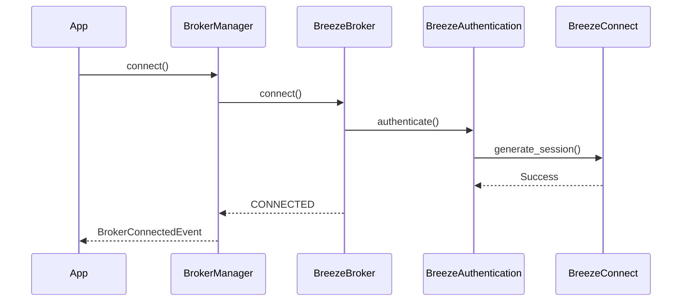

# Broker Lifecycle

```mermaid
sequenceDiagram
    participant App
    participant Manager as BrokerManager
    participant Broker as BreezeBroker
    participant Auth as BreezeAuthentication
    participant SDK as BreezeConnect

    App->>Manager: connect()
    Manager->>Broker: connect()
    Broker->>Auth: authenticate()
    Auth->>SDK: generate_session()
    SDK-->>Auth: Success
    Broker-->>Manager: CONNECTED
    Manager-->>App: BrokerConnectedEvent
```
