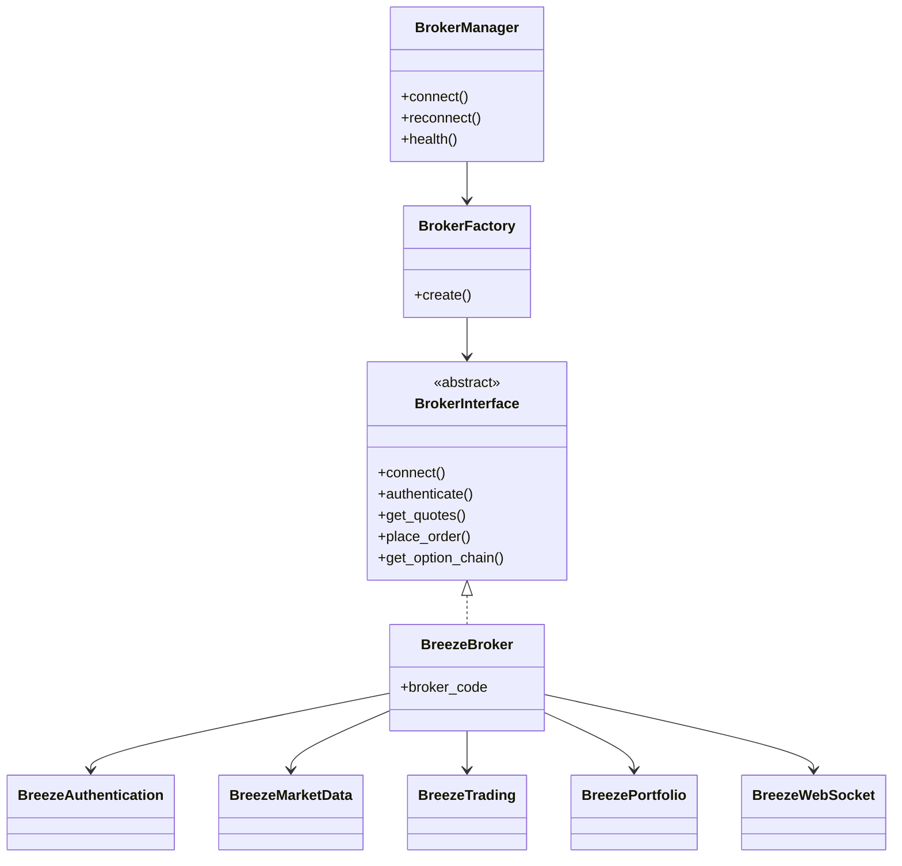

# Broker Class Diagram

```mermaid
classDiagram
    class BrokerInterface {
        <<abstract>>
        +connect()
        +authenticate()
        +get_quotes()
        +place_order()
        +get_option_chain()
    }
    class BrokerFactory {
        +create()
    }
    class BrokerManager {
        +connect()
        +reconnect()
        +health()
    }
    class BreezeBroker {
        +broker_code
    }
    class BreezeAuthentication
    class BreezeMarketData
    class BreezeTrading
    class BreezePortfolio
    class BreezeWebSocket

    BrokerInterface <|.. BreezeBroker
    BrokerFactory --> BrokerInterface
    BrokerManager --> BrokerFactory
    BreezeBroker --> BreezeAuthentication
    BreezeBroker --> BreezeMarketData
    BreezeBroker --> BreezeTrading
    BreezeBroker --> BreezePortfolio
    BreezeBroker --> BreezeWebSocket
```
