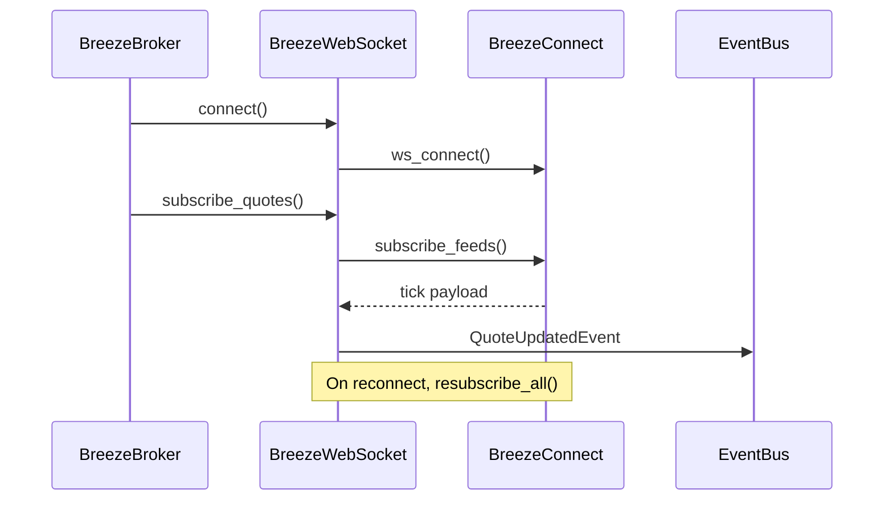

# WebSocket Flow

```mermaid
sequenceDiagram
    participant Broker as BreezeBroker
    participant WS as BreezeWebSocket
    participant SDK as BreezeConnect
    participant Bus as EventBus

    Broker->>WS: connect()
    WS->>SDK: ws_connect()
    Broker->>WS: subscribe_quotes()
    WS->>SDK: subscribe_feeds()
    SDK-->>WS: tick payload
    WS->>Bus: QuoteUpdatedEvent
    Note over WS,SDK: On reconnect, resubscribe_all()
```
