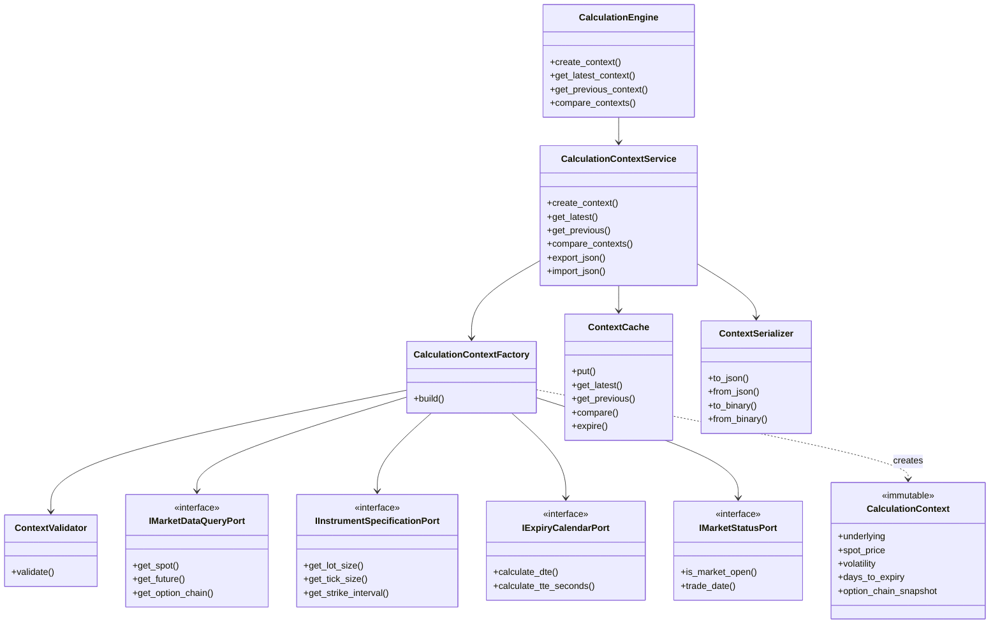
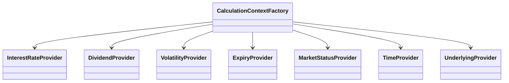

# Calculation Engine Class Diagram

## Provider Layer

## Port Adapters

Frozen upstream modules are accessed only through adapters at bootstrap time:

- `MarketDataQueryPortAdapter` → `MarketDataQueryService`
- `InstrumentSpecificationPortAdapter` → `InstrumentService`
- `ExpiryCalendarPortAdapter` → `ExpiryManager`
- `MarketStatusPortAdapter` → `MarketCalendarService`
