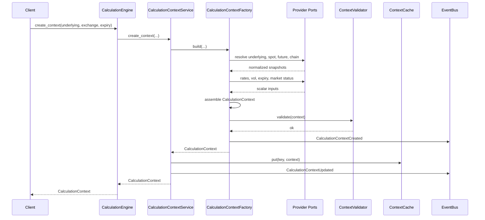
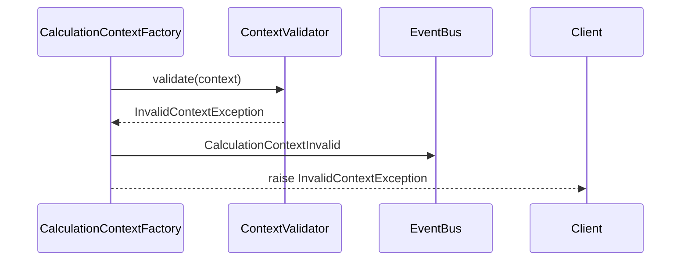
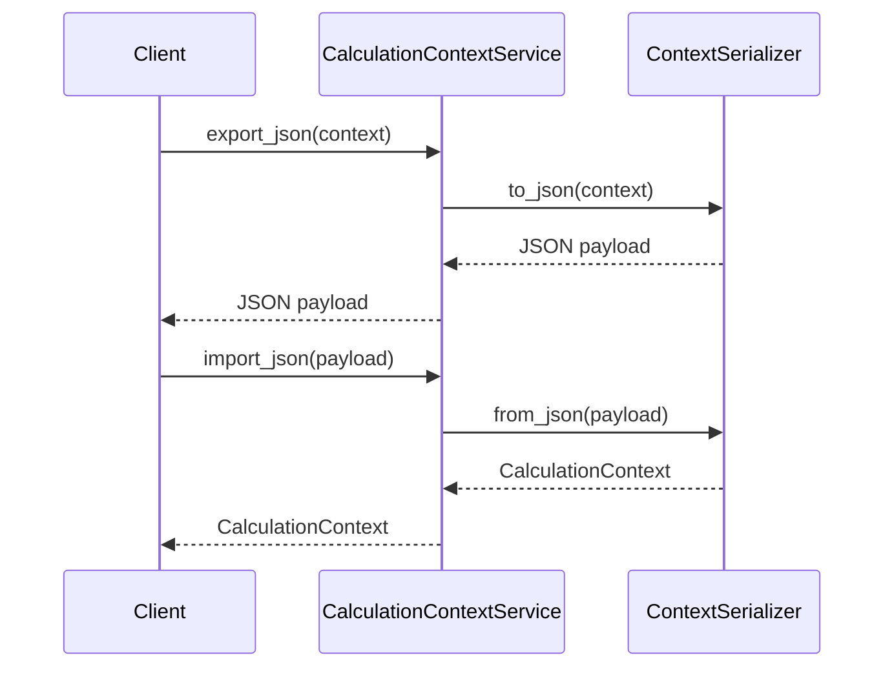

# Calculation Engine Sequence Diagram

## Context Creation

```mermaid
sequenceDiagram
    participant Client
    participant Engine as CalculationEngine
    participant Service as CalculationContextService
    participant Factory as CalculationContextFactory
    participant Ports as Provider Ports
    participant Validator as ContextValidator
    participant Cache as ContextCache
    participant Bus as EventBus

    Client->>Engine: create_context(underlying, exchange, expiry)
    Engine->>Service: create_context(...)
    Service->>Factory: build(...)
    Factory->>Ports: resolve underlying, spot, future, chain
    Ports-->>Factory: normalized snapshots
    Factory->>Ports: rates, vol, expiry, market status
    Ports-->>Factory: scalar inputs
    Factory->>Factory: assemble CalculationContext
    Factory->>Validator: validate(context)
    Validator-->>Factory: ok
    Factory->>Bus: CalculationContextCreated
    Factory-->>Service: CalculationContext
    Service->>Cache: put(key, context)
    Service->>Bus: CalculationContextUpdated
    Service-->>Engine: CalculationContext
    Engine-->>Client: CalculationContext
```

## Validation Failure

```mermaid
sequenceDiagram
    participant Factory as CalculationContextFactory
    participant Validator as ContextValidator
    participant Bus as EventBus
    participant Client

    Factory->>Validator: validate(context)
    Validator-->>Factory: InvalidContextException
    Factory->>Bus: CalculationContextInvalid
    Factory-->>Client: raise InvalidContextException
```

## Serialization

```mermaid
sequenceDiagram
    participant Client
    participant Service as CalculationContextService
    participant Serializer as ContextSerializer

    Client->>Service: export_json(context)
    Service->>Serializer: to_json(context)
    Serializer-->>Service: JSON payload
    Service-->>Client: JSON payload

    Client->>Service: import_json(payload)
    Service->>Serializer: from_json(payload)
    Serializer-->>Service: CalculationContext
    Service-->>Client: CalculationContext
```
