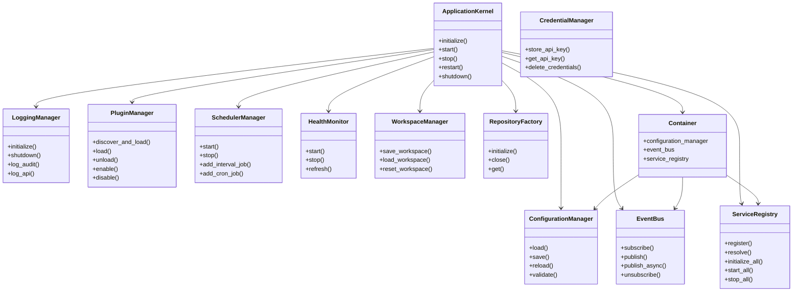

# Class Diagram (Foundation)

```mermaid
classDiagram
    class ApplicationKernel {
        +initialize()
        +start()
        +stop()
        +restart()
        +shutdown()
    }

    class ConfigurationManager {
        +load()
        +save()
        +reload()
        +validate()
    }

    class ServiceRegistry {
        +register()
        +resolve()
        +initialize_all()
        +start_all()
        +stop_all()
    }

    class EventBus {
        +subscribe()
        +publish()
        +publish_async()
        +unsubscribe()
    }

    class LoggingManager {
        +initialize()
        +shutdown()
        +log_audit()
        +log_api()
    }

    class PluginManager {
        +discover_and_load()
        +load()
        +unload()
        +enable()
        +disable()
    }

    class SchedulerManager {
        +start()
        +stop()
        +add_interval_job()
        +add_cron_job()
    }

    class HealthMonitor {
        +start()
        +stop()
        +refresh()
    }

    class WorkspaceManager {
        +save_workspace()
        +load_workspace()
        +reset_workspace()
    }

    class CredentialManager {
        +store_api_key()
        +get_api_key()
        +delete_credentials()
    }

    class RepositoryFactory {
        +initialize()
        +close()
        +get()
    }

  class Container {
        +configuration_manager
        +event_bus
        +service_registry
    }

    ApplicationKernel --> ConfigurationManager
    ApplicationKernel --> Container
    ApplicationKernel --> ServiceRegistry
    ApplicationKernel --> EventBus
    ApplicationKernel --> LoggingManager
    ApplicationKernel --> PluginManager
    ApplicationKernel --> SchedulerManager
    ApplicationKernel --> HealthMonitor
    ApplicationKernel --> WorkspaceManager
    ApplicationKernel --> RepositoryFactory
    Container --> ConfigurationManager
    Container --> EventBus
    Container --> ServiceRegistry
```
