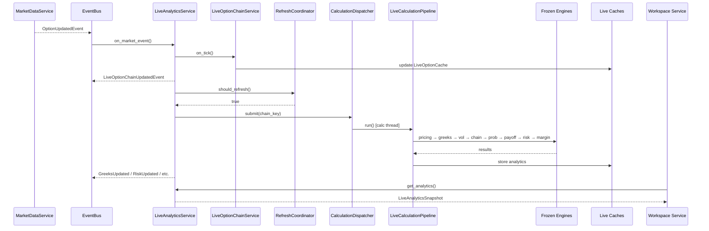

# Live Analytics Sequence Diagram

```mermaid
sequenceDiagram
    participant MD as MarketDataService
    participant BUS as EventBus
    participant LA as LiveAnalyticsService
    participant OC as LiveOptionChainService
    participant RC as RefreshCoordinator
    participant CD as CalculationDispatcher
    participant PL as LiveCalculationPipeline
    participant ENG as Frozen Engines
    participant CACHE as Live Caches
    participant WS as Workspace Service

    MD-->>BUS: OptionUpdatedEvent
    BUS->>LA: on_market_event()
    LA->>OC: on_tick()
    OC->>CACHE: update LiveOptionCache
    LA-->>BUS: LiveOptionChainUpdatedEvent
    LA->>RC: should_refresh()
    RC-->>LA: true
    LA->>CD: submit(chain_key)
    CD->>PL: run() [calc thread]
    PL->>ENG: pricing → greeks → vol → chain → prob → payoff → risk → margin
    ENG-->>PL: results
    PL->>CACHE: store analytics
    LA-->>BUS: GreeksUpdated / RiskUpdated / etc.
    WS->>LA: get_analytics()
    LA-->>WS: LiveAnalyticsSnapshot
```
