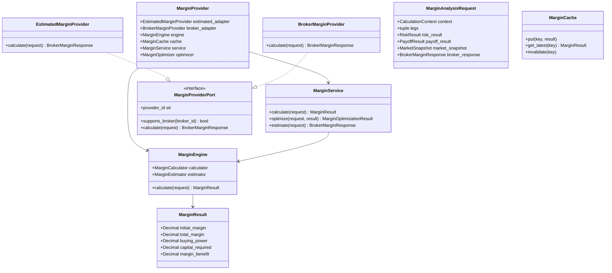

# Margin Class Diagram

```mermaid
classDiagram
    class MarginProvider {
        +EstimatedMarginProvider estimated_adapter
        +BrokerMarginProvider broker_adapter
        +MarginEngine engine
        +MarginCache cache
        +MarginService service
        +MarginOptimizer optimizer
    }

    class MarginService {
        +calculate(request) MarginResult
        +optimize(request, result) MarginOptimizationResult
        +estimate(request) BrokerMarginResponse
    }

    class MarginEngine {
        +MarginCalculator calculator
        +MarginEstimator estimator
        +calculate(request) MarginResult
    }

    class MarginProviderPort {
        <<interface>>
        +provider_id str
        +supports_broker(broker_id) bool
        +calculate(request) BrokerMarginResponse
    }

    class EstimatedMarginProvider {
        +calculate(request) BrokerMarginResponse
    }

    class BrokerMarginProvider {
        +calculate(request) BrokerMarginResponse
    }

    class MarginAnalysisRequest {
        +CalculationContext context
        +tuple legs
        +RiskResult risk_result
        +PayoffResult payoff_result
        +MarketSnapshot market_snapshot
        +BrokerMarginResponse broker_response
    }

    class MarginResult {
        +Decimal initial_margin
        +Decimal total_margin
        +Decimal buying_power
        +Decimal capital_required
        +Decimal margin_benefit
    }

    class MarginCache {
        +put(key, result)
        +get_latest(key) MarginResult
        +invalidate(key)
    }

    MarginProvider --> MarginService
    MarginProvider --> MarginEngine
    EstimatedMarginProvider ..|> MarginProviderPort
    BrokerMarginProvider ..|> MarginProviderPort
    MarginService --> MarginEngine
    MarginEngine --> MarginResult
```
