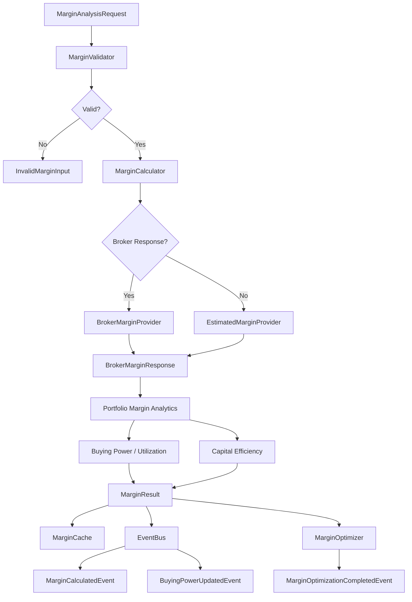

# Margin Flow

## Steps

1. **Validate** — context, legs, risk, payoff, market snapshot
2. **Resolve Margin** — broker response or estimated SPAN/exposure
3. **Portfolio Analytics** — margin benefit, offset, peak margin
4. **Capital Metrics** — buying power, utilization, efficiency, leverage
5. **Cache & Publish** — store results and emit domain events
6. **Optimize** — capital efficiency score and reduction suggestions

## Margin Components

| Component | Description |
|-----------|-------------|
| Initial Margin | Per-leg SPAN + exposure (shorts) or premium (longs) |
| Exposure Margin | Short leg notional × exposure rate |
| SPAN Margin | Short leg notional × SPAN rate |
| Portfolio Margin | Initial minus hedging benefit |
| Additional Margin | Risk-based add-on from capital at risk |
| Total Margin | Portfolio + additional |
