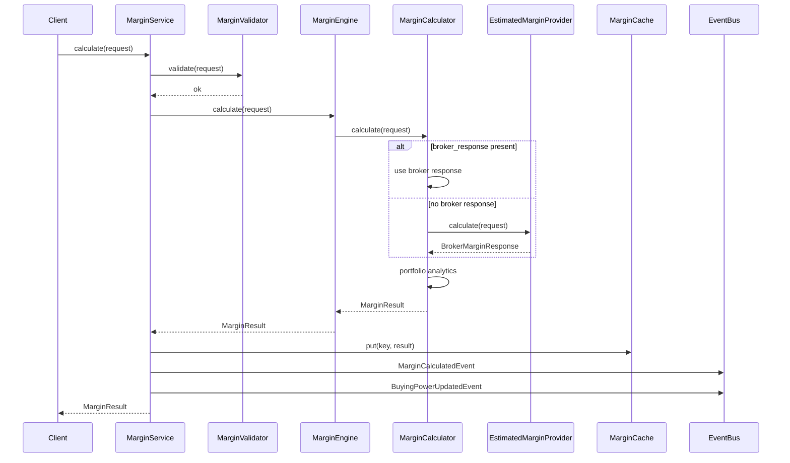
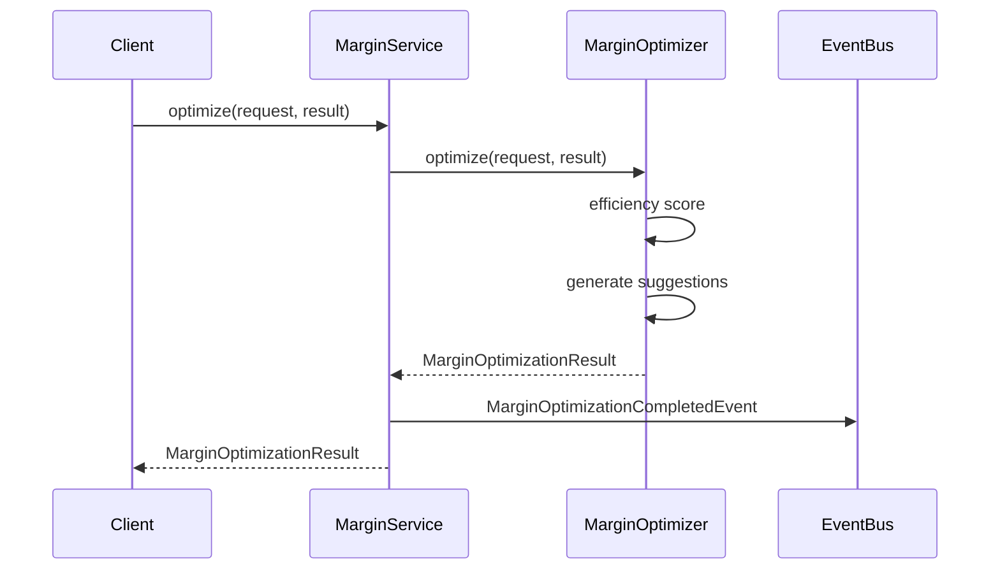

# Margin Sequence Diagram

```mermaid
sequenceDiagram
    participant Client
    participant MarginService
    participant MarginValidator
    participant MarginEngine
    participant MarginCalculator
    participant EstimatedMarginProvider
    participant MarginCache
    participant EventBus

    Client->>MarginService: calculate(request)
    MarginService->>MarginValidator: validate(request)
    MarginValidator-->>MarginService: ok
    MarginService->>MarginEngine: calculate(request)
    MarginEngine->>MarginCalculator: calculate(request)
    alt broker_response present
        MarginCalculator->>MarginCalculator: use broker response
    else no broker response
        MarginCalculator->>EstimatedMarginProvider: calculate(request)
        EstimatedMarginProvider-->>MarginCalculator: BrokerMarginResponse
    end
    MarginCalculator->>MarginCalculator: portfolio analytics
    MarginCalculator-->>MarginEngine: MarginResult
    MarginEngine-->>MarginService: MarginResult
    MarginService->>MarginCache: put(key, result)
    MarginService->>EventBus: MarginCalculatedEvent
    MarginService->>EventBus: BuyingPowerUpdatedEvent
    MarginService-->>Client: MarginResult
```

## Optimization Sequence

```mermaid
sequenceDiagram
    participant Client
    participant MarginService
    participant MarginOptimizer
    participant EventBus

    Client->>MarginService: optimize(request, result)
    MarginService->>MarginOptimizer: optimize(request, result)
    MarginOptimizer->>MarginOptimizer: efficiency score
    MarginOptimizer->>MarginOptimizer: generate suggestions
    MarginOptimizer-->>MarginService: MarginOptimizationResult
    MarginService->>EventBus: MarginOptimizationCompletedEvent
    MarginService-->>Client: MarginOptimizationResult
```
