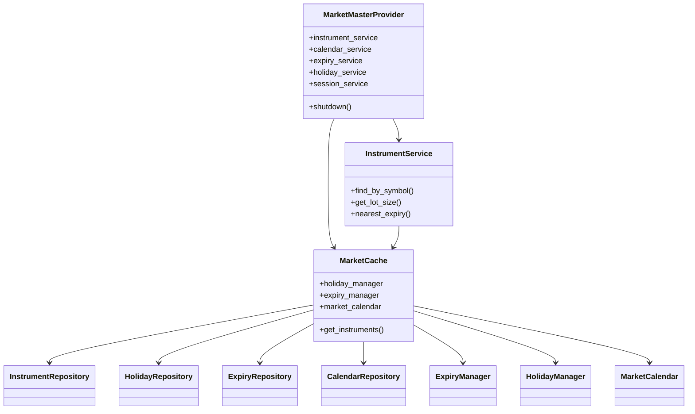

# Market Master Class Diagram

```mermaid
classDiagram
    class MarketMasterProvider {
        +instrument_service
        +calendar_service
        +expiry_service
        +holiday_service
        +session_service
        +shutdown()
    }

    class MarketCache {
        +get_instruments()
        +holiday_manager
        +expiry_manager
        +market_calendar
    }

    class InstrumentService {
        +find_by_symbol()
        +get_lot_size()
        +nearest_expiry()
    }

    class InstrumentRepository
    class HolidayRepository
    class ExpiryRepository
    class CalendarRepository
    class ExpiryManager
    class HolidayManager
    class MarketCalendar

    MarketMasterProvider --> MarketCache
    MarketMasterProvider --> InstrumentService
    MarketCache --> InstrumentRepository
    MarketCache --> HolidayRepository
    MarketCache --> ExpiryRepository
    MarketCache --> CalendarRepository
    MarketCache --> ExpiryManager
    MarketCache --> HolidayManager
    MarketCache --> MarketCalendar
    InstrumentService --> MarketCache
```
