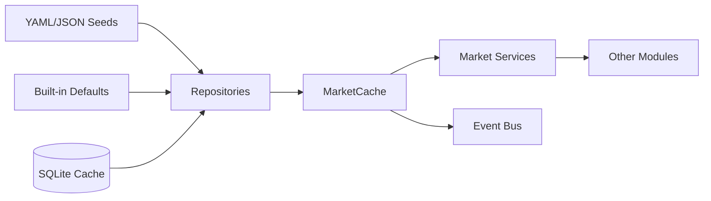

# Market Master Data Flow

## Load Order

1. Built-in underlying definitions
2. YAML/JSON seed files
3. SQLite persisted instruments

## Lazy Loading

`MarketCache` loads each subsystem on first access:

- Instruments
- Holidays
- Expiries
- Calendar/Sessions

Events are published when each layer is loaded.
