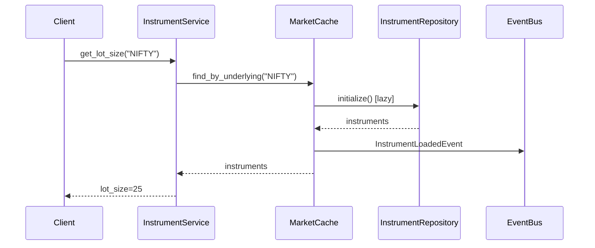

# Market Master Sequence Diagram

```mermaid
sequenceDiagram
    participant Client
    participant Service as InstrumentService
    participant Cache as MarketCache
    participant Repo as InstrumentRepository
    participant Bus as EventBus

    Client->>Service: get_lot_size("NIFTY")
    Service->>Cache: find_by_underlying("NIFTY")
    Cache->>Repo: initialize() [lazy]
    Repo-->>Cache: instruments
    Cache->>Bus: InstrumentLoadedEvent
    Cache-->>Service: instruments
    Service-->>Client: lot_size=25
```
