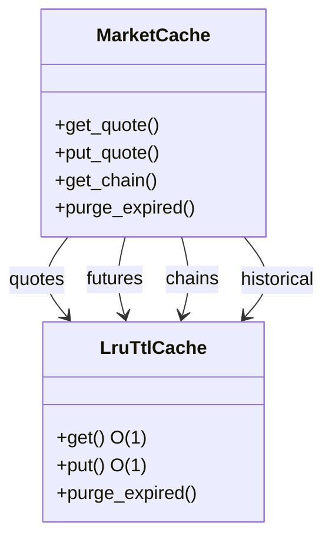

# Cache Architecture

```mermaid
classDiagram
    class MarketCache {
        +get_quote()
        +put_quote()
        +get_chain()
        +purge_expired()
    }
    class LruTtlCache {
        +get() O(1)
        +put() O(1)
        +purge_expired()
    }
    MarketCache --> LruTtlCache : quotes
    MarketCache --> LruTtlCache : futures
    MarketCache --> LruTtlCache : chains
    MarketCache --> LruTtlCache : historical
```

- Thread-safe `RLock` on all operations
- Default TTL: 300 seconds
- Default max quotes: 10,000
- LRU eviction when capacity exceeded
