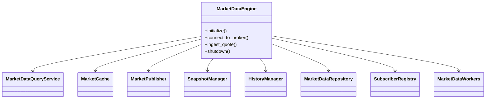

# Market Data Class Diagram

```mermaid
classDiagram
    class MarketDataEngine {
        +initialize()
        +connect_to_broker()
        +ingest_quote()
        +shutdown()
    }
    class MarketDataQueryService
    class MarketCache
    class MarketPublisher
    class SnapshotManager
    class HistoryManager
    class MarketDataRepository
    class SubscriberRegistry
    class MarketDataWorkers

    MarketDataEngine --> MarketDataQueryService
    MarketDataEngine --> MarketCache
    MarketDataEngine --> MarketPublisher
    MarketDataEngine --> SnapshotManager
    MarketDataEngine --> HistoryManager
    MarketDataEngine --> MarketDataRepository
    MarketDataEngine --> SubscriberRegistry
    MarketDataEngine --> MarketDataWorkers
```
