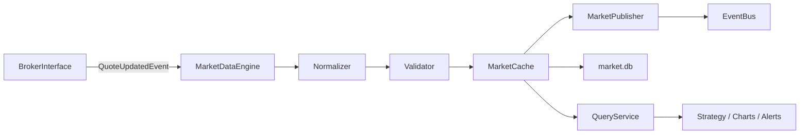

# Market Data Flow

```mermaid
flowchart LR
    Broker[BrokerInterface] -->|QuoteUpdatedEvent| Engine[MarketDataEngine]
    Engine --> Normalizer
    Normalizer --> Validator
    Validator --> Cache[MarketCache]
    Cache --> Publisher[MarketPublisher]
    Publisher --> EventBus
    Cache --> Repository[market.db]
    Cache --> Query[QueryService]
    Query --> Consumers[Strategy / Charts / Alerts]
```
