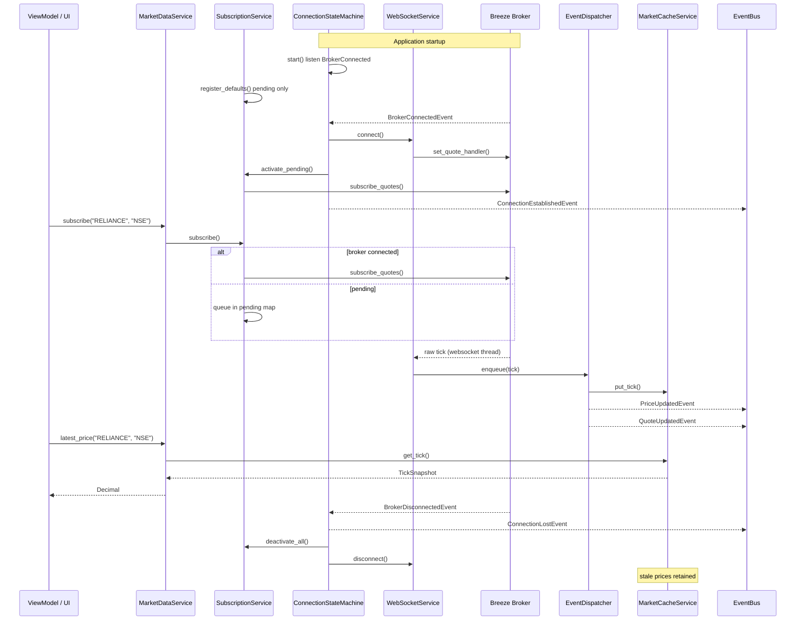

# Live Market Data — Sequence Diagram

```mermaid
sequenceDiagram
    participant UI as ViewModel / UI
    participant MDS as MarketDataService
    participant SUB as SubscriptionService
    participant CS as ConnectionStateMachine
    participant WS as WebSocketService
    participant BR as Breeze Broker
    participant DISP as EventDispatcher
    participant CACHE as MarketCacheService
    participant BUS as EventBus

    Note over CS,BR: Application startup
    CS->>CS: start() listen BrokerConnected
    SUB->>SUB: register_defaults() pending only

    BR-->>CS: BrokerConnectedEvent
    CS->>WS: connect()
    WS->>BR: set_quote_handler()
    CS->>SUB: activate_pending()
    SUB->>BR: subscribe_quotes()
    CS-->>BUS: ConnectionEstablishedEvent

    UI->>MDS: subscribe("RELIANCE", "NSE")
    MDS->>SUB: subscribe()
    alt broker connected
        SUB->>BR: subscribe_quotes()
    else pending
        SUB->>SUB: queue in pending map
    end

    BR-->>WS: raw tick (websocket thread)
    WS->>DISP: enqueue(tick)
    DISP->>CACHE: put_tick()
    DISP-->>BUS: PriceUpdatedEvent
    DISP-->>BUS: QuoteUpdatedEvent

    UI->>MDS: latest_price("RELIANCE", "NSE")
    MDS->>CACHE: get_tick()
    CACHE-->>MDS: TickSnapshot
    MDS-->>UI: Decimal

    BR-->>CS: BrokerDisconnectedEvent
    CS-->>BUS: ConnectionLostEvent
    CS->>SUB: deactivate_all()
    CS->>WS: disconnect()
    Note over CACHE: stale prices retained
```
