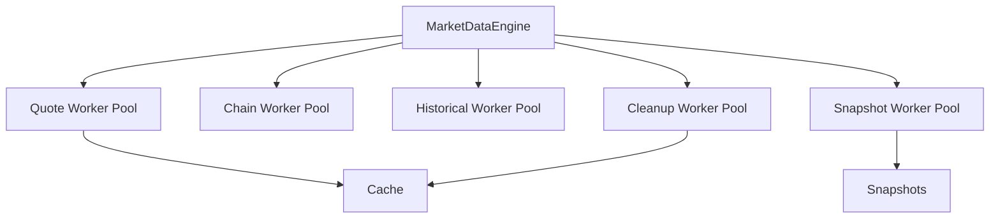

# Worker Architecture

```mermaid
flowchart TB
    Engine[MarketDataEngine] --> QW[Quote Worker Pool]
    Engine --> CW[Chain Worker Pool]
    Engine --> HW[Historical Worker Pool]
    Engine --> SW[Snapshot Worker Pool]
    Engine --> CL[Cleanup Worker Pool]
    QW --> Cache
    SW --> Snapshots
    CL --> Cache
```

Each pool uses `WorkerPool` with dedicated daemon threads. Tasks are queued and processed without blocking the UI thread.
