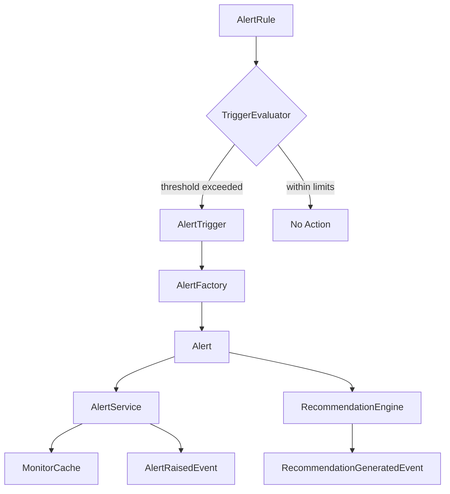
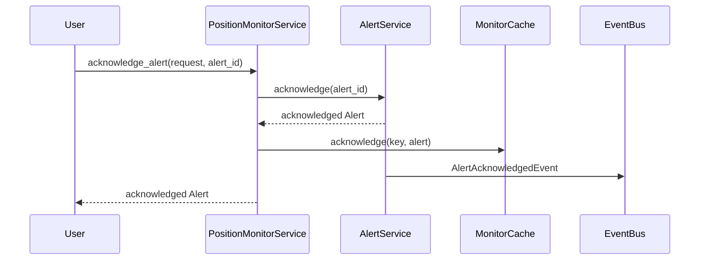

# Alert Flow

## Rule to Alert Pipeline

## Built-in Rules

| Rule | Trigger | Engine Source |
|------|---------|---------------|
| Maximum Loss | Unrealized PnL ≤ threshold | PortfolioResult |
| Maximum Profit | Unrealized PnL ≥ threshold | PortfolioResult |
| Maximum Delta | \|delta\| ≥ threshold | RiskResult |
| Maximum Gamma | \|gamma\| ≥ threshold | RiskResult |
| Maximum Vega | \|vega\| ≥ threshold | RiskResult |
| Maximum Theta | theta ≤ threshold | RiskResult |
| Maximum Margin | utilization ≥ threshold | MarginResult |
| Maximum Drawdown | drawdown ≥ threshold | RiskResult / Performance |
| Time To Expiry | DTE ≤ threshold | CalculationContext |
| IV Spike | IV change ≥ threshold | RiskResult / Context |
| IV Crush | IV change ≤ threshold | CalculationContext |
| OI Shift | Option chain event | MarketDataEvent |
| Price Gap | Quote update event | MarketDataEvent |
| Custom | Expression flag | Configurable |

## Alert Priorities

| Priority | Use Case |
|----------|----------|
| Information | Profit target, IV crush |
| Warning | Greeks limits, expiry, price gap |
| Critical | Loss limit, margin, drawdown |
| Emergency | Reserved for future escalation |

## Acknowledgement Flow

## Recommendation Mapping

| Trigger | Suggestion Type |
|---------|-----------------|
| Loss threshold | Reduce Risk |
| Profit target | Take Profit |
| Margin limit | Increase Capital |
| Delta limit | Hedge Position |
| Gamma limit | Reduce Position |
| Theta decay | Roll Position |
| Expiry warning | Close Position |
| Volatility spike | Reduce Position |
