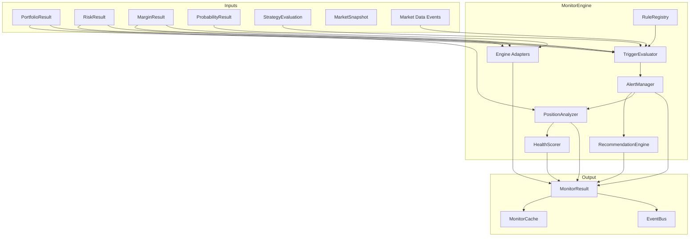

# Monitor Architecture

## Overview

The Position Monitor & Alert Engine observes live portfolio state and compares engine outputs against configurable thresholds. It generates alerts and framework recommendations without recalculating pricing, Greeks, probability, payoff, or margin.

## Layers

| Layer | Responsibility |
|-------|----------------|
| Models | Immutable dataclasses for monitors, alerts, recommendations |
| Engine | Orchestrates rules, triggers, alerts, recommendations |
| Rules | Built-in thresholds plus custom rule registry |
| Triggers | Threshold comparison against engine outputs |
| Alerts | Alert materialization and acknowledgement |
| Recommendations | Framework suggestions (no AI) |
| Analytics | Engine adapters, health score, position snapshots |
| Scheduler | Configurable monitoring intervals |
| Services | Orchestration, caching, events |
| Cache | Latest results, history, acknowledged alerts |

## Architecture Diagram

## Engine Consumption

| Monitor Field | Source |
|---------------|--------|
| Greeks Summary | `RiskResult` net greeks |
| Risk Summary | `RiskResult` VaR, risk score, drawdown |
| Margin Summary | `MarginResult` utilization, buying power |
| Probability Summary | `ProbabilityResult` POP, expected value |
| PnL thresholds | `PortfolioResult` unrealized PnL |
| Expiry warning | `CalculationContext.days_to_expiry` |

## Extensibility

Framework hooks for future:

- AI recommendations
- Email, SMS, push, Telegram, WhatsApp, Slack notifications

## Performance

- Stateless trigger evaluation for horizontal scaling
- Thread-safe cache with TTL
- Target: 1,000 positions under one second
