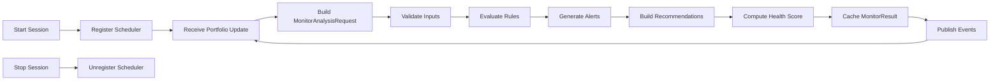
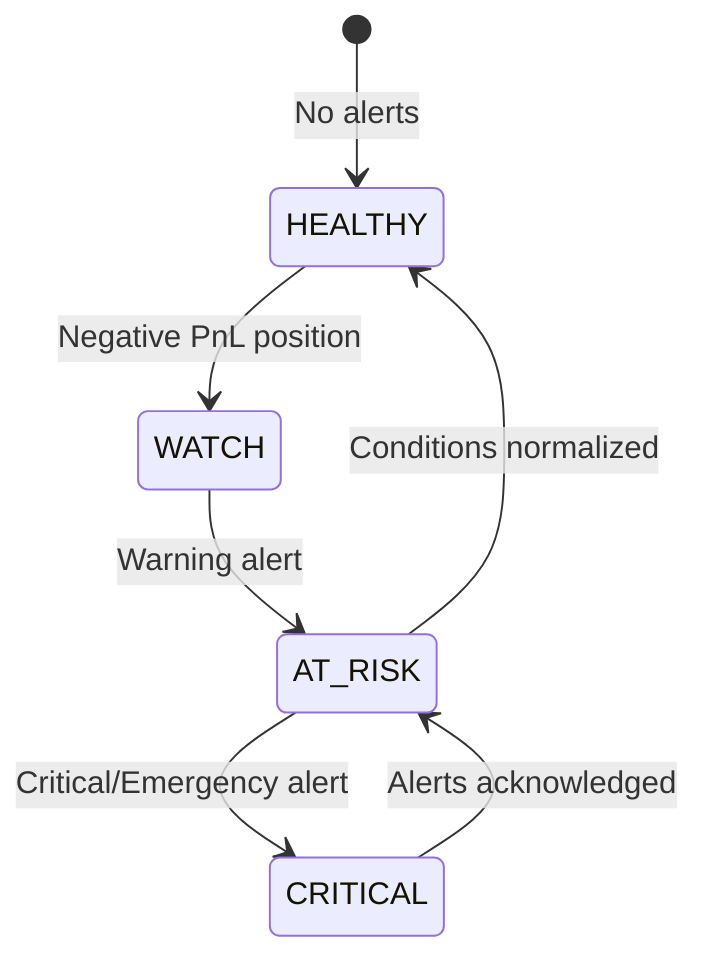

# Monitoring Flow

## Continuous Monitoring Lifecycle

## Monitored Dimensions

| Dimension | Data Source |
|-----------|-------------|
| Open Positions | `PortfolioResult.open_positions` |
| Cash | `PortfolioResult.cash_balance` |
| Margin | `MarginResult` / `PortfolioResult.used_margin` |
| PnL | `PortfolioResult` realized/unrealized/today |
| Greeks | `RiskResult` via adapter |
| Risk | `RiskResult` via adapter |
| Probability | `ProbabilityResult` via adapter |

## Scheduler Intervals

| Interval | Seconds |
|----------|---------|
| Real-time | 0 |
| Every Tick | 0 |
| Every Second | 1 |
| Every Minute | 60 |
| Custom | Configurable |

## Position Health States

## Session Management

1. `start_monitoring(portfolio_id, interval)` creates `MonitoringSession`
2. Scheduler registers session with configured interval
3. Each tick calls `evaluate(request)` with latest engine outputs
4. `stop_monitoring(session_id)` deactivates session and publishes event
