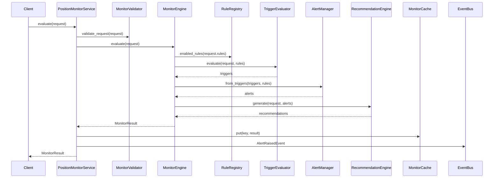
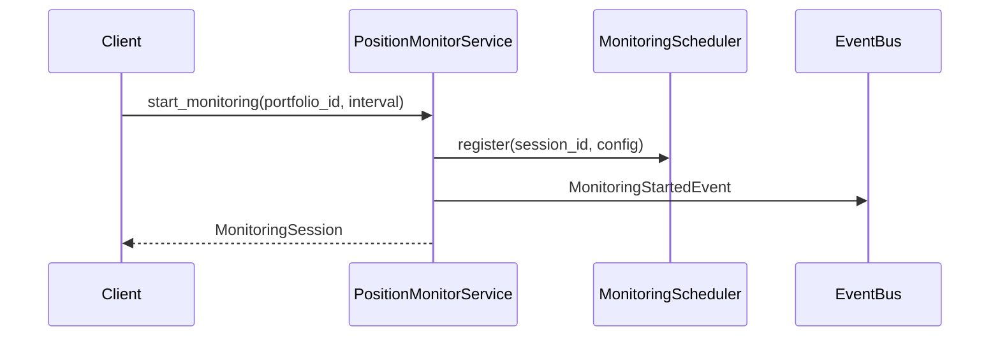
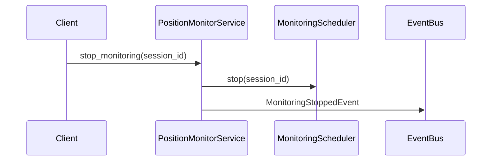

# Monitor Sequence Diagram

## Evaluate Positions

```mermaid
sequenceDiagram
    participant Client
    participant Service as PositionMonitorService
    participant Validator as MonitorValidator
    participant Engine as MonitorEngine
    participant Rules as RuleRegistry
    participant Triggers as TriggerEvaluator
    participant Alerts as AlertManager
    participant Recs as RecommendationEngine
    participant Cache as MonitorCache
    participant Bus as EventBus

    Client->>Service: evaluate(request)
    Service->>Validator: validate_request(request)
    Service->>Engine: evaluate(request)
    Engine->>Rules: enabled_rules(request.rules)
    Engine->>Triggers: evaluate(request, rules)
    Triggers-->>Engine: triggers
    Engine->>Alerts: from_triggers(triggers, rules)
    Alerts-->>Engine: alerts
    Engine->>Recs: generate(request, alerts)
    Recs-->>Engine: recommendations
    Engine-->>Service: MonitorResult
    Service->>Cache: put(key, result)
    Service->>Bus: AlertRaisedEvent
    Service-->>Client: MonitorResult
```

## Start Monitoring Session

```mermaid
sequenceDiagram
    participant Client
    participant Service as PositionMonitorService
    participant Scheduler as MonitoringScheduler
    participant Bus as EventBus

    Client->>Service: start_monitoring(portfolio_id, interval)
    Service->>Scheduler: register(session_id, config)
    Service->>Bus: MonitoringStartedEvent
    Service-->>Client: MonitoringSession
```

## Stop Monitoring Session

```mermaid
sequenceDiagram
    participant Client
    participant Service as PositionMonitorService
    participant Scheduler as MonitoringScheduler
    participant Bus as EventBus

    Client->>Service: stop_monitoring(session_id)
    Service->>Scheduler: stop(session_id)
    Service->>Bus: MonitoringStoppedEvent
```
