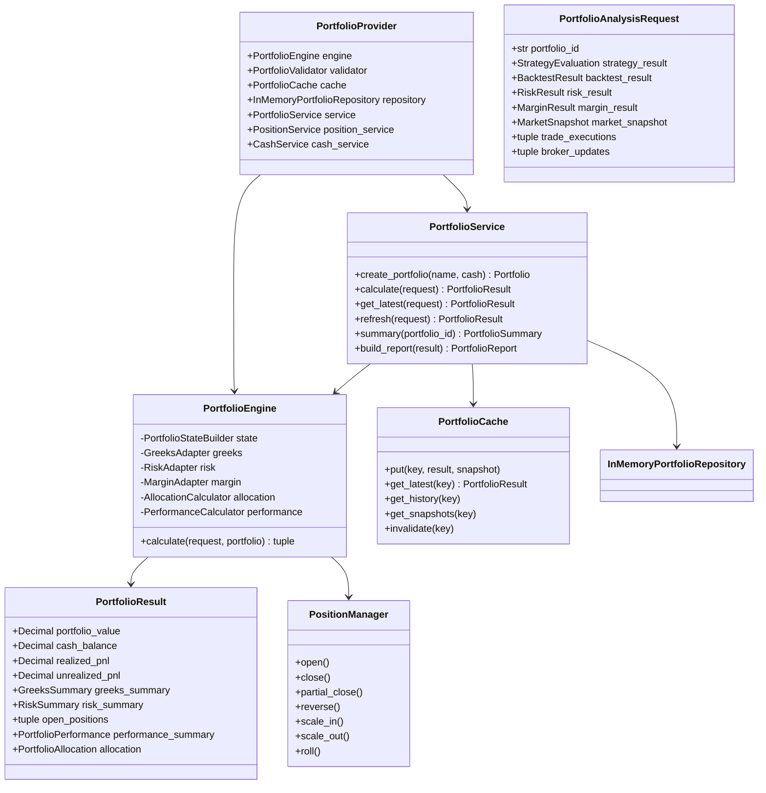

# Portfolio Class Diagram

```mermaid
classDiagram
    class PortfolioProvider {
        +PortfolioEngine engine
        +PortfolioValidator validator
        +PortfolioCache cache
        +InMemoryPortfolioRepository repository
        +PortfolioService service
        +PositionService position_service
        +CashService cash_service
    }

    class PortfolioService {
        +create_portfolio(name, cash) Portfolio
        +calculate(request) PortfolioResult
        +get_latest(request) PortfolioResult
        +refresh(request) PortfolioResult
        +summary(portfolio_id) PortfolioSummary
        +build_report(result) PortfolioReport
    }

    class PortfolioEngine {
        +calculate(request, portfolio) tuple
        -PortfolioStateBuilder state
        -GreeksAdapter greeks
        -RiskAdapter risk
        -MarginAdapter margin
        -AllocationCalculator allocation
        -PerformanceCalculator performance
    }

    class PortfolioAnalysisRequest {
        +str portfolio_id
        +StrategyEvaluation strategy_result
        +BacktestResult backtest_result
        +RiskResult risk_result
        +MarginResult margin_result
        +MarketSnapshot market_snapshot
        +tuple trade_executions
        +tuple broker_updates
    }

    class PortfolioResult {
        +Decimal portfolio_value
        +Decimal cash_balance
        +Decimal realized_pnl
        +Decimal unrealized_pnl
        +GreeksSummary greeks_summary
        +RiskSummary risk_summary
        +tuple open_positions
        +PortfolioPerformance performance_summary
        +PortfolioAllocation allocation
    }

    class PortfolioCache {
        +put(key, result, snapshot)
        +get_latest(key) PortfolioResult
        +get_history(key)
        +get_snapshots(key)
        +invalidate(key)
    }

    class PositionManager {
        +open()
        +close()
        +partial_close()
        +reverse()
        +scale_in()
        +scale_out()
        +roll()
    }

    PortfolioProvider --> PortfolioService
    PortfolioProvider --> PortfolioEngine
    PortfolioService --> PortfolioEngine
    PortfolioService --> PortfolioCache
    PortfolioService --> InMemoryPortfolioRepository
    PortfolioEngine --> PortfolioResult
    PortfolioEngine --> PositionManager
```
