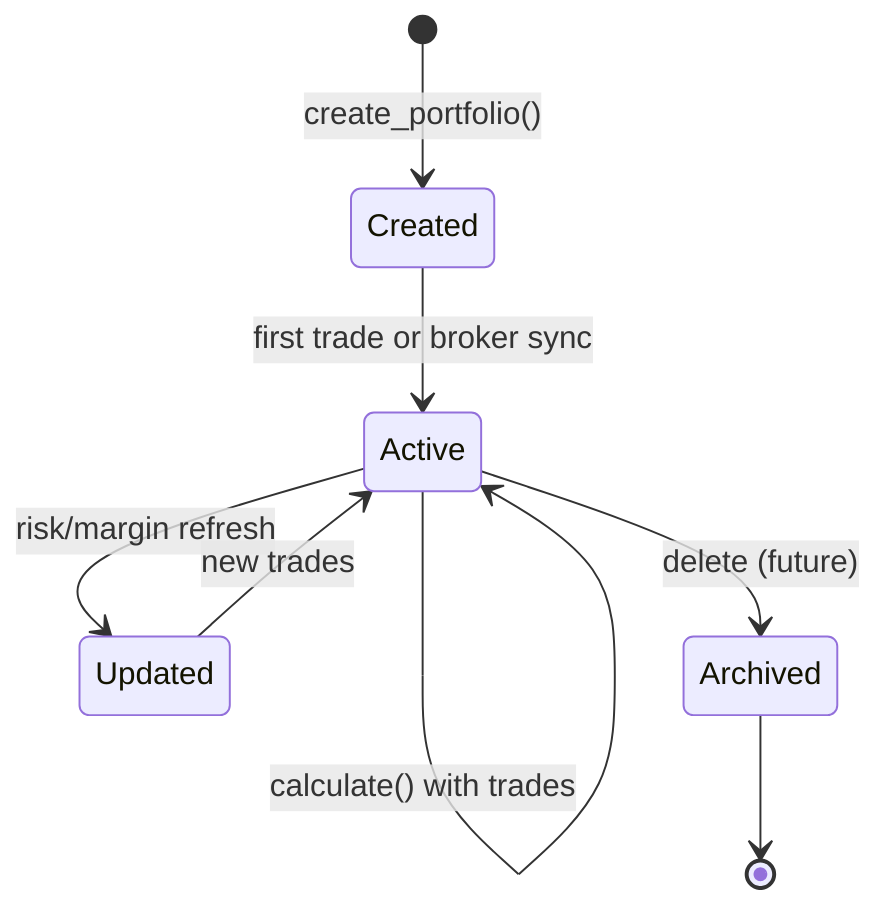
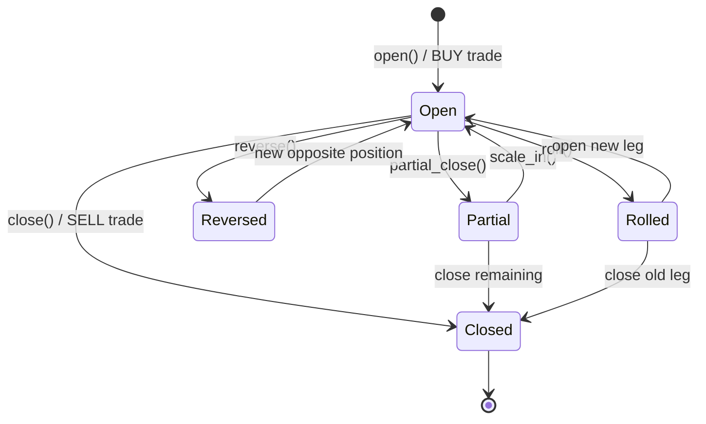

# Portfolio Lifecycle

## States

## Position Lifecycle

## Event Timeline

| Event | Trigger |
|-------|---------|
| `PortfolioCreatedEvent` | `create_portfolio()` |
| `PortfolioUpdatedEvent` | `calculate()` completes |
| `TradeRecordedEvent` | Trade execution applied |
| `PositionOpenedEvent` | Open positions present |
| `PositionClosedEvent` | Closed positions present |
| `PerformanceUpdatedEvent` | Performance metrics updated |

## Cache Lifecycle

1. **Miss** — Engine calculates fresh `PortfolioResult`
2. **Put** — Result stored with snapshot and value history
3. **Hit** — `get_latest()` returns cached result within TTL
4. **Refresh** — `invalidate()` then recalculate
5. **Expire** — TTL purge on next access

## Integrity Checks

`PortfolioValidator` enforces:

- Non-empty `portfolio_id`
- Positive trade prices and non-zero quantities
- Cash balance non-negative
- Available cash ≤ balance
- Reserved cash non-negative
