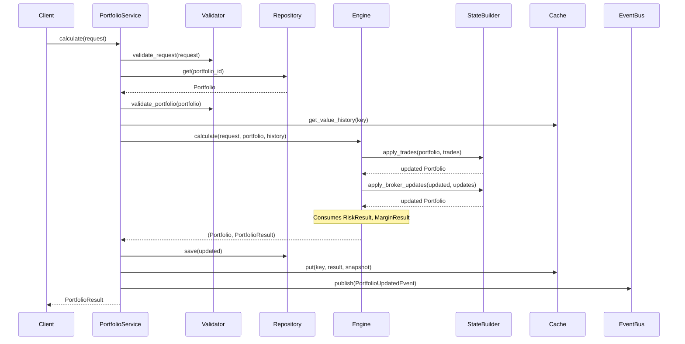
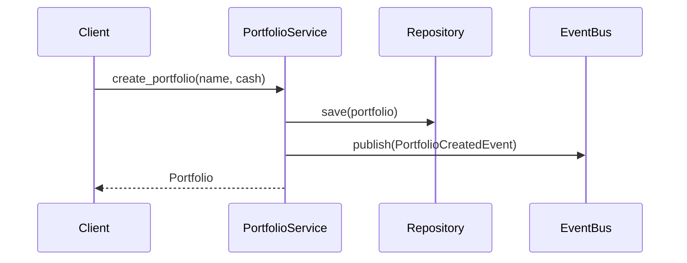

# Portfolio Sequence Diagram

```mermaid
sequenceDiagram
    participant Client
    participant PortfolioService
    participant Validator
    participant Repository
    participant Engine
    participant StateBuilder
    participant Cache
    participant EventBus

    Client->>PortfolioService: calculate(request)
    PortfolioService->>Validator: validate_request(request)
    PortfolioService->>Repository: get(portfolio_id)
    Repository-->>PortfolioService: Portfolio
    PortfolioService->>Validator: validate_portfolio(portfolio)
    PortfolioService->>Cache: get_value_history(key)
    PortfolioService->>Engine: calculate(request, portfolio, history)
    Engine->>StateBuilder: apply_trades(portfolio, trades)
    StateBuilder-->>Engine: updated Portfolio
    Engine->>StateBuilder: apply_broker_updates(updated, updates)
    StateBuilder-->>Engine: updated Portfolio
    Note over Engine: Consumes RiskResult, MarginResult
    Engine-->>PortfolioService: (Portfolio, PortfolioResult)
    PortfolioService->>Repository: save(updated)
    PortfolioService->>Cache: put(key, result, snapshot)
    PortfolioService->>EventBus: publish(PortfolioUpdatedEvent)
    PortfolioService-->>Client: PortfolioResult
```

## Portfolio Creation

```mermaid
sequenceDiagram
    participant Client
    participant PortfolioService
    participant Repository
    participant EventBus

    Client->>PortfolioService: create_portfolio(name, cash)
    PortfolioService->>Repository: save(portfolio)
    PortfolioService->>EventBus: publish(PortfolioCreatedEvent)
    PortfolioService-->>Client: Portfolio
```
