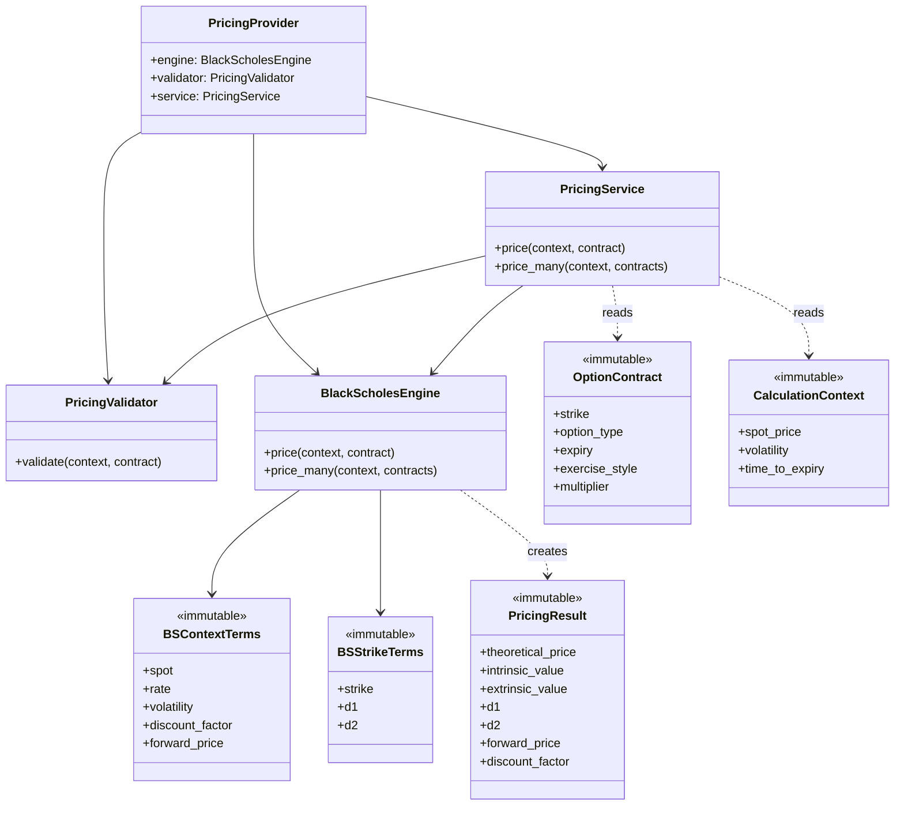
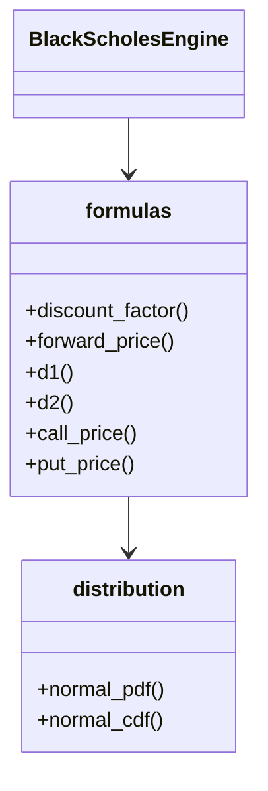

# Pricing Engine Class Diagram

```mermaid
classDiagram
    class PricingProvider {
        +engine: BlackScholesEngine
        +validator: PricingValidator
        +service: PricingService
    }

    class PricingService {
        +price(context, contract)
        +price_many(context, contracts)
    }

    class PricingValidator {
        +validate(context, contract)
    }

    class BlackScholesEngine {
        +price(context, contract)
        +price_many(context, contracts)
    }

    class BSContextTerms {
        <<immutable>>
        +spot
        +rate
        +volatility
        +discount_factor
        +forward_price
    }

    class BSStrikeTerms {
        <<immutable>>
        +strike
        +d1
        +d2
    }

    class OptionContract {
        <<immutable>>
        +strike
        +option_type
        +expiry
        +exercise_style
        +multiplier
    }

    class PricingResult {
        <<immutable>>
        +theoretical_price
        +intrinsic_value
        +extrinsic_value
        +d1
        +d2
        +forward_price
        +discount_factor
    }

    class CalculationContext {
        <<immutable>>
        +spot_price
        +volatility
        +time_to_expiry
    }

    PricingProvider --> PricingService
    PricingProvider --> BlackScholesEngine
    PricingProvider --> PricingValidator
    PricingService --> PricingValidator
    PricingService --> BlackScholesEngine
    BlackScholesEngine --> BSContextTerms
    BlackScholesEngine --> BSStrikeTerms
    BlackScholesEngine ..> PricingResult : creates
    PricingService ..> CalculationContext : reads
    PricingService ..> OptionContract : reads
```

## Formula Layer

```mermaid
classDiagram
    class formulas {
        +discount_factor()
        +forward_price()
        +d1()
        +d2()
        +call_price()
        +put_price()
    }

    class distribution {
        +normal_pdf()
        +normal_cdf()
    }

    formulas --> distribution
    BlackScholesEngine --> formulas
```
