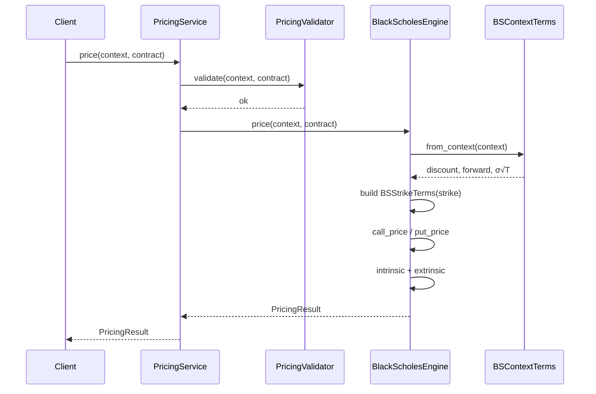
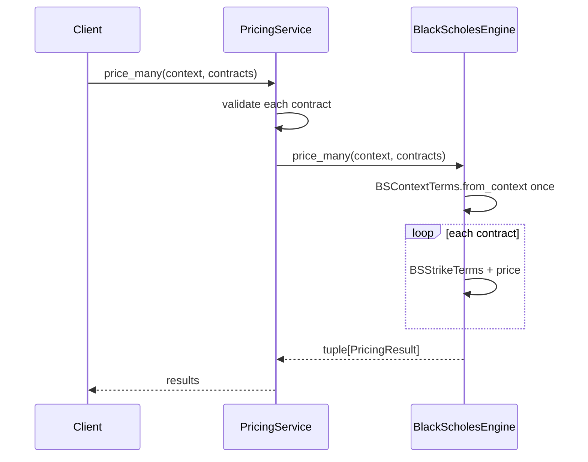

# Black-Scholes Pricing Flow

## Single Contract



## Batch Pricing



## Validation Failure Paths

| Check | Exception |
|-------|-----------|
| T ≤ 0 | `ExpiredContractException` |
| Non-European style | `InvalidPricingInput` |
| Spot/strike/vol ≤ 0 | `InvalidPricingInput` |
| Expiry mismatch | `InvalidPricingInput` |

## Data Dependencies

```
CalculationContext ──► BSContextTerms ──► BSStrikeTerms ──► PricingResult
OptionContract     ────────────────────────┘
```

No broker, database, or market data engine access occurs inside the pricing module.

## Performance Path

1. Convert `Decimal` context fields to `float` once per context
2. Precompute `exp(-rT)`, forward price, and `σ√T`
3. Per strike: compute `d1`, `d2`, two CDF evaluations
4. Quantize outputs back to `Decimal` for result objects

Batch APIs avoid rebuilding step 1–2 for every strike.
