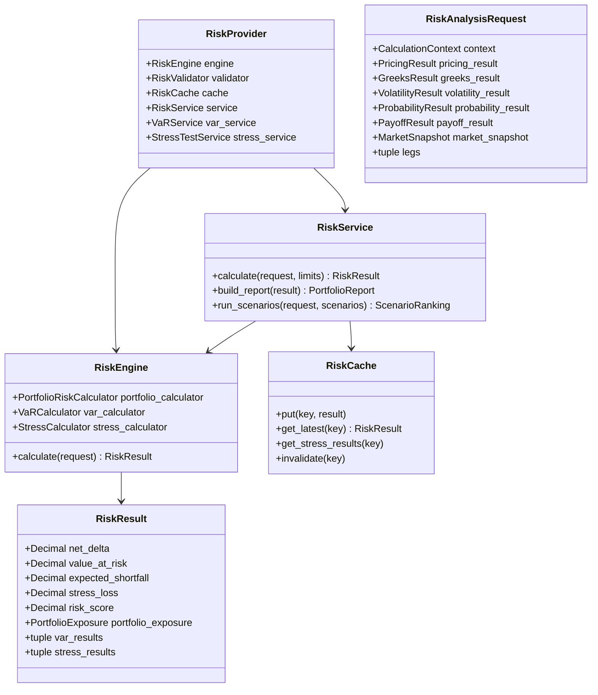

# Risk Class Diagram

```mermaid
classDiagram
    class RiskProvider {
        +RiskEngine engine
        +RiskValidator validator
        +RiskCache cache
        +RiskService service
        +VaRService var_service
        +StressTestService stress_service
    }

    class RiskService {
        +calculate(request, limits) RiskResult
        +build_report(result) PortfolioReport
        +run_scenarios(request, scenarios) ScenarioRanking
    }

    class RiskEngine {
        +PortfolioRiskCalculator portfolio_calculator
        +VaRCalculator var_calculator
        +StressCalculator stress_calculator
        +calculate(request) RiskResult
    }

    class RiskAnalysisRequest {
        +CalculationContext context
        +PricingResult pricing_result
        +GreeksResult greeks_result
        +VolatilityResult volatility_result
        +ProbabilityResult probability_result
        +PayoffResult payoff_result
        +MarketSnapshot market_snapshot
        +tuple legs
    }

    class RiskResult {
        +Decimal net_delta
        +Decimal value_at_risk
        +Decimal expected_shortfall
        +Decimal stress_loss
        +Decimal risk_score
        +PortfolioExposure portfolio_exposure
        +tuple var_results
        +tuple stress_results
    }

    class RiskCache {
        +put(key, result)
        +get_latest(key) RiskResult
        +get_stress_results(key)
        +invalidate(key)
    }

    RiskProvider --> RiskService
    RiskProvider --> RiskEngine
    RiskService --> RiskEngine
    RiskService --> RiskCache
    RiskEngine --> RiskResult
```
