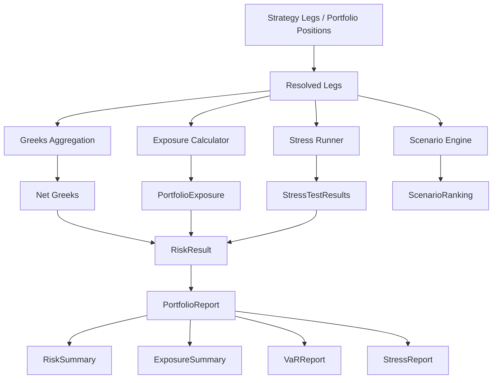

# Portfolio Flow

## Exposure Dimensions

| Dimension | Description |
|-----------|-------------|
| Underlying | Notional and weight per underlying symbol |
| Expiry | Exposure grouped by expiration date |
| Option Type | Call vs put exposure |
| Sector | Underlying grouping (sector label) |

## Concentration

Herfindahl index across leg notionals measures portfolio concentration.

## Limit Checking

Optional `RiskLimitConfig` enables warnings for:

- Maximum delta, gamma, vega
- Maximum loss, margin, position size
- Maximum capital exposure
