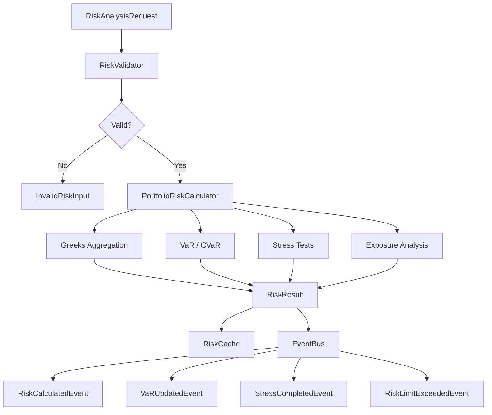

# Risk Flow

## Steps

1. **Validate** — context, pricing, greeks, volatility, probability, payoff, legs, snapshot
2. **Aggregate Greeks** — net delta through vomma across all legs
3. **VaR** — historical, parametric, variance-covariance at 95% and 99%
4. **CVaR** — expected shortfall and tail loss
5. **Stress** — price shocks ±1% to ±20%, IV, time, rate, combined
6. **Exposure** — underlying, expiry, option type, sector breakdown
7. **Limits** — check configured thresholds, generate warnings
8. **Cache & Publish** — store results and emit domain events
