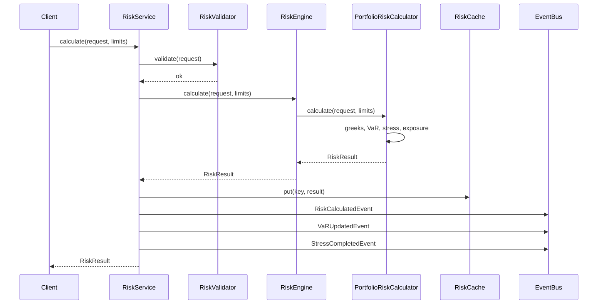
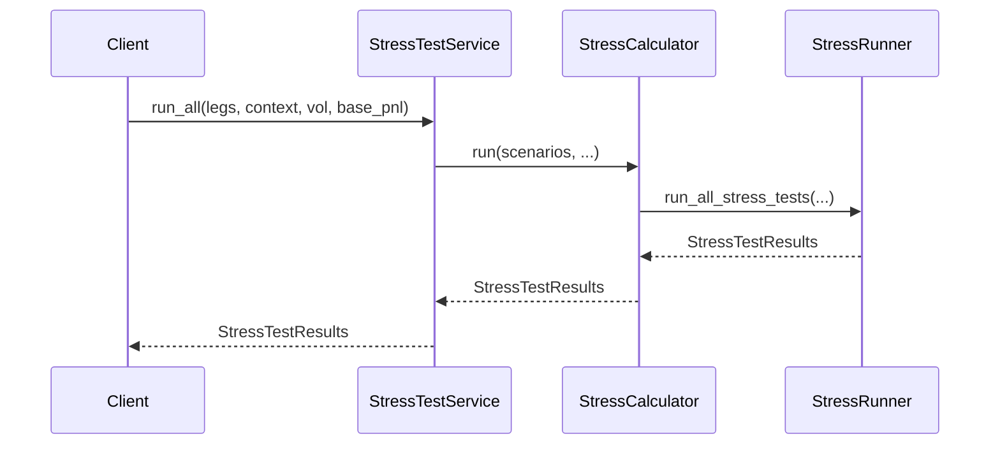

# Risk Sequence Diagram

```mermaid
sequenceDiagram
    participant Client
    participant RiskService
    participant RiskValidator
    participant RiskEngine
    participant PortfolioRiskCalculator
    participant RiskCache
    participant EventBus

    Client->>RiskService: calculate(request, limits)
    RiskService->>RiskValidator: validate(request)
    RiskValidator-->>RiskService: ok
    RiskService->>RiskEngine: calculate(request, limits)
    RiskEngine->>PortfolioRiskCalculator: calculate(request, limits)
    PortfolioRiskCalculator->>PortfolioRiskCalculator: greeks, VaR, stress, exposure
    PortfolioRiskCalculator-->>RiskEngine: RiskResult
    RiskEngine-->>RiskService: RiskResult
    RiskService->>RiskCache: put(key, result)
    RiskService->>EventBus: RiskCalculatedEvent
    RiskService->>EventBus: VaRUpdatedEvent
    RiskService->>EventBus: StressCompletedEvent
    RiskService-->>Client: RiskResult
```

## Stress Test Sequence

```mermaid
sequenceDiagram
    participant Client
    participant StressTestService
    participant StressCalculator
    participant StressRunner

    Client->>StressTestService: run_all(legs, context, vol, base_pnl)
    StressTestService->>StressCalculator: run(scenarios, ...)
    StressCalculator->>StressRunner: run_all_stress_tests(...)
    StressRunner-->>StressCalculator: StressTestResults
    StressCalculator-->>StressTestService: StressTestResults
    StressTestService-->>Client: StressTestResults
```
