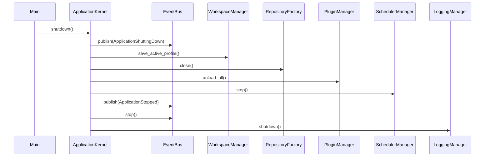

# Shutdown Flow

## Steps

1. **Stop Workers** — Thread pool shutdown
2. **Save Workspace** — Active layout profile persisted
3. **Flush Logs** — Loguru complete()
4. **Close Repositories** — Repository factory cleanup
5. **Unload Plugins** — Plugin on_unload hooks
6. **Shutdown Scheduler** — APScheduler shutdown
7. **Close Application** — Exception handler uninstalled
