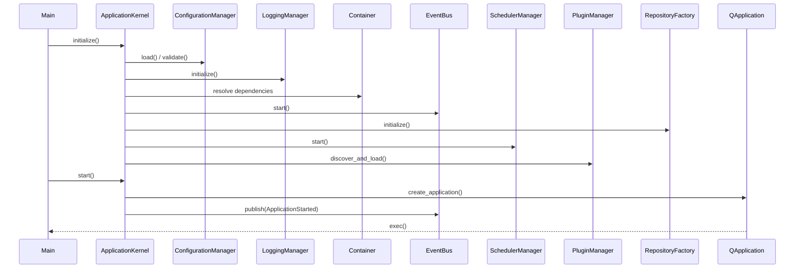

# Startup Flow

## Steps

1. **Load Config** — YAML files merged and validated via Pydantic
2. **Initialize Logger** — Loguru sinks configured
3. **Initialize DI** — Container resolves singletons
4. **Initialize Event Bus** — Background async worker started
5. **Initialize Scheduler** — APScheduler started
6. **Initialize Plugins** — Manifest discovery and load
7. **Initialize Workspace** — Workspace manager ready
8. **Initialize Repository Factory** — Data directories and placeholders
9. **Initialize UI** — Qt application instance created
10. **Run Application** — Qt event loop
