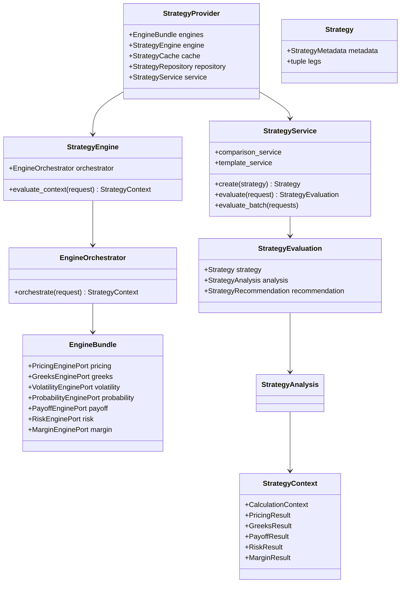

# Strategy Class Diagram

```mermaid
classDiagram
    class StrategyProvider {
        +EngineBundle engines
        +StrategyEngine engine
        +StrategyCache cache
        +StrategyRepository repository
        +StrategyService service
    }

    class StrategyService {
        +create(strategy) Strategy
        +evaluate(request) StrategyEvaluation
        +evaluate_batch(requests)
        +comparison_service
        +template_service
    }

    class StrategyEngine {
        +EngineOrchestrator orchestrator
        +evaluate_context(request) StrategyContext
    }

    class EngineOrchestrator {
        +orchestrate(request) StrategyContext
    }

    class EngineBundle {
        +PricingEnginePort pricing
        +GreeksEnginePort greeks
        +VolatilityEnginePort volatility
        +ProbabilityEnginePort probability
        +PayoffEnginePort payoff
        +RiskEnginePort risk
        +MarginEnginePort margin
    }

    class Strategy {
        +StrategyMetadata metadata
        +tuple legs
    }

    class StrategyContext {
        +CalculationContext
        +PricingResult
        +GreeksResult
        +PayoffResult
        +RiskResult
        +MarginResult
    }

    class StrategyEvaluation {
        +Strategy strategy
        +StrategyAnalysis analysis
        +StrategyRecommendation recommendation
    }

    StrategyProvider --> StrategyService
    StrategyProvider --> StrategyEngine
    StrategyEngine --> EngineOrchestrator
    EngineOrchestrator --> EngineBundle
    StrategyService --> StrategyEvaluation
    StrategyEvaluation --> StrategyAnalysis
    StrategyAnalysis --> StrategyContext
```
