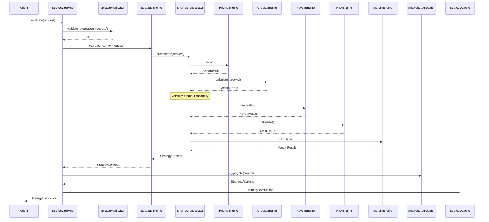
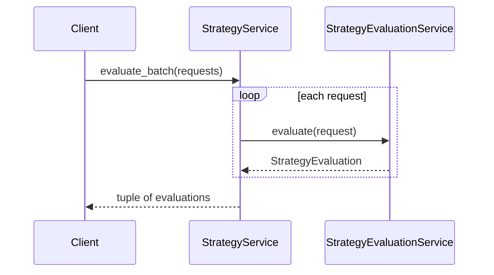

# Strategy Sequence Diagram

```mermaid
sequenceDiagram
    participant Client
    participant StrategyService
    participant StrategyValidator
    participant StrategyEngine
    participant EngineOrchestrator
    participant PricingEngine
    participant GreeksEngine
    participant PayoffEngine
    participant RiskEngine
    participant MarginEngine
    participant AnalysisAggregator
    participant StrategyCache

    Client->>StrategyService: evaluate(request)
    StrategyService->>StrategyValidator: validate_evaluation_request()
    StrategyValidator-->>StrategyService: ok
    StrategyService->>StrategyEngine: evaluate_context(request)
    StrategyEngine->>EngineOrchestrator: orchestrate(request)
    EngineOrchestrator->>PricingEngine: price()
    PricingEngine-->>EngineOrchestrator: PricingResult
    EngineOrchestrator->>GreeksEngine: calculate_greeks()
    GreeksEngine-->>EngineOrchestrator: GreeksResult
    Note over EngineOrchestrator: Volatility, Chain, Probability
    EngineOrchestrator->>PayoffEngine: calculate()
    PayoffEngine-->>EngineOrchestrator: PayoffResult
    EngineOrchestrator->>RiskEngine: calculate()
    RiskEngine-->>EngineOrchestrator: RiskResult
    EngineOrchestrator->>MarginEngine: calculate()
    MarginEngine-->>EngineOrchestrator: MarginResult
    EngineOrchestrator-->>StrategyEngine: StrategyContext
    StrategyEngine-->>StrategyService: StrategyContext
    StrategyService->>AnalysisAggregator: aggregate(context)
    AnalysisAggregator-->>StrategyService: StrategyAnalysis
    StrategyService->>StrategyCache: put(key, evaluation)
    StrategyService-->>Client: StrategyEvaluation
```

## Batch Evaluation

```mermaid
sequenceDiagram
    participant Client
    participant StrategyService
    participant StrategyEvaluationService

    Client->>StrategyService: evaluate_batch(requests)
    loop each request
        StrategyService->>StrategyEvaluationService: evaluate(request)
        StrategyEvaluationService-->>StrategyService: StrategyEvaluation
    end
    StrategyService-->>Client: tuple of evaluations
```
