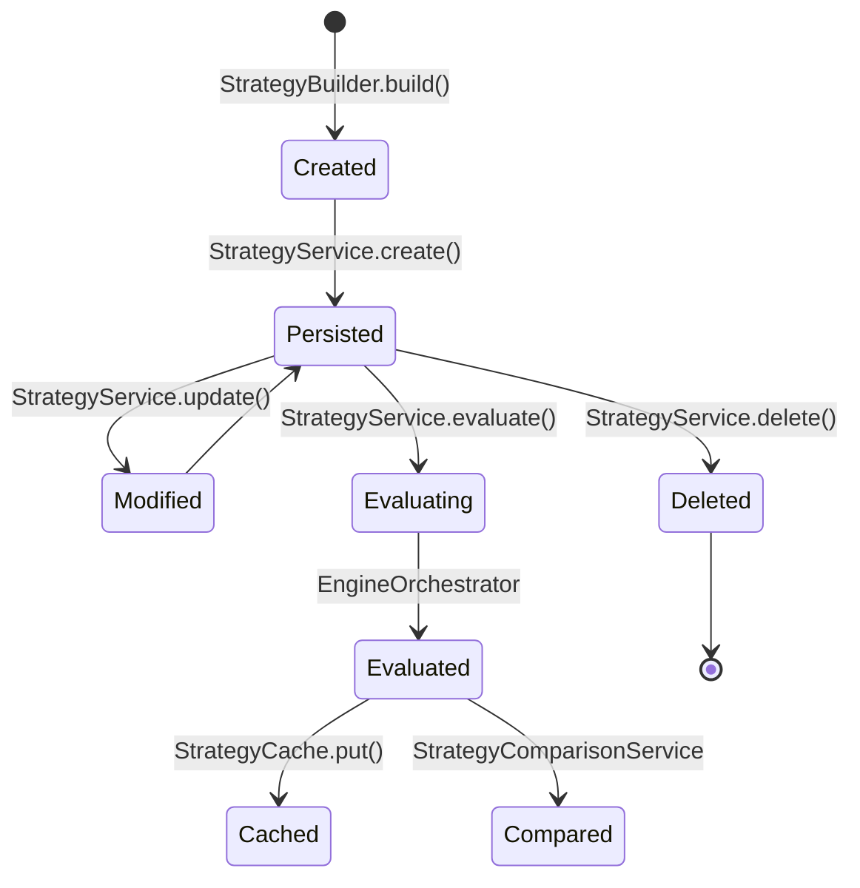

# Strategy Lifecycle

## Lifecycle Stages

| Stage | Action | Events |
|-------|--------|--------|
| Create | Build legs via `StrategyBuilder`, persist via repository | `StrategyCreatedEvent` |
| Modify | Update legs, save to repository | `StrategyModifiedEvent` |
| Evaluate | Orchestrate frozen engines, aggregate analysis | `StrategyEvaluatedEvent` |
| Compare | Rank multiple evaluations | `StrategyComparedEvent` |
| Delete | Remove from repository | `StrategyDeletedEvent` |

## Evaluation Flow

1. Validate strategy and request
2. Convert strategy legs to payoff legs
3. Orchestrate engines in dependency order
4. Build `StrategyContext` from engine results
5. Aggregate analysis and compute scores (from engine outputs)
6. Recognize strategy type (display only)
7. Build recommendation and cache result

## Templates

- Built-in templates provide starter leg configurations
- Custom templates stored in cache
- JSON import/export via `StrategyTemplateService`
